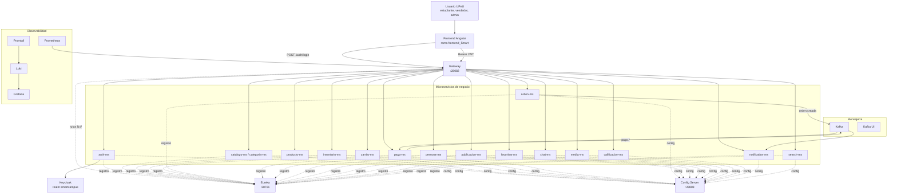
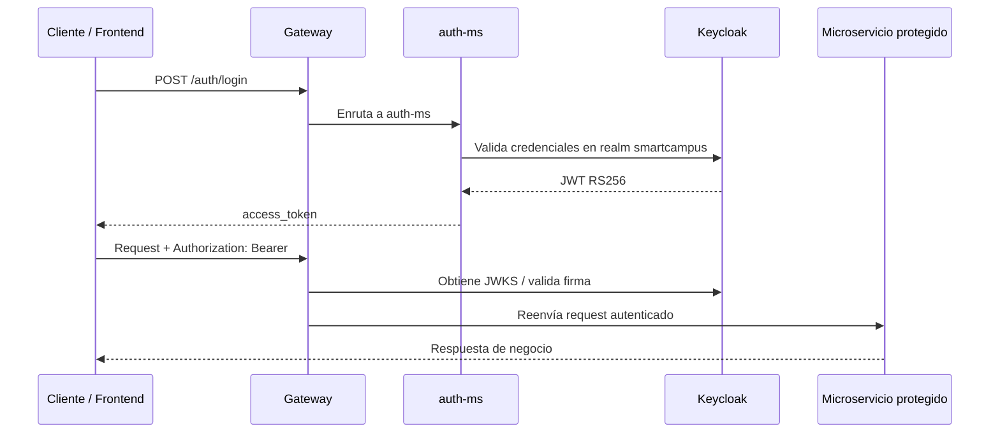
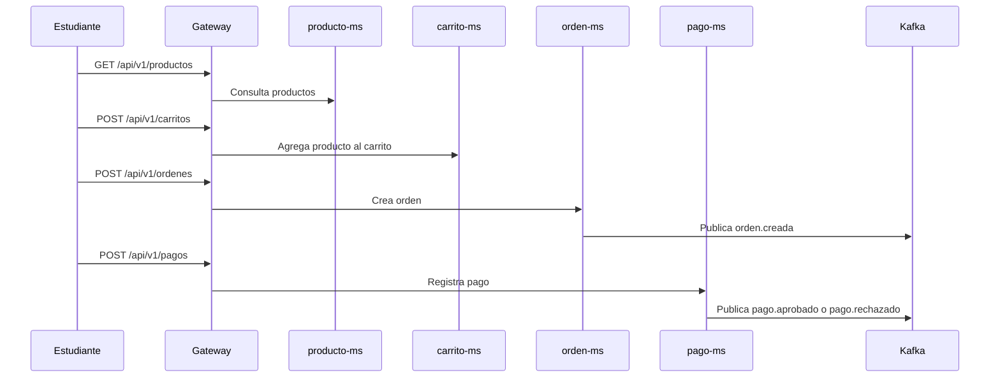

# Arquitectura

## Visión general

SmartCampus Marketplace implementa un marketplace universitario mediante microservicios. El cliente consume un **API Gateway**; los servicios se registran en **Eureka**, cargan configuración desde **Config Server**, validan identidad con **Keycloak** y se comunican mediante HTTP síncrono y eventos Kafka.

---

## Infraestructura transversal

| Componente | Ruta | Función |
|---|---|---|
| Config Server | `infra/config` | Publica configuración centralizada desde `config-repo` |
| Eureka | `infra/eureka` | Registro y descubrimiento de servicios |
| Gateway | `infra/gateway` | Entrada única HTTP, CORS, JWT y enrutamiento |
| Keycloak | `keycloak` | Realm `smartcampus`, usuarios, roles y JWKS |
| Kafka | `kafka` | Eventos de dominio y desacoplamiento |
| Observabilidad | `obs` | Métricas, logs y paneles |

---

## Flujo de autenticación

---

## Flujo de compra

---

## Rutas principales del Gateway

Las rutas se centralizan en `infra/config/config-repo/gateway-dev.yml` y `gateway-prod.yml`.

| Ruta | Servicio |
|---|---|
| `/auth/**` | `auth-ms` |
| `/api/v1/categorias/**` | `catalogo-ms` |
| `/api/v1/productos/**` | `producto-ms` |
| `/api/v1/carritos/**` | `carrito-ms` |
| `/api/v1/inventarios/**` | `inventario-ms` |
| `/api/v1/ordenes/**` | `orden-ms` |
| `/api/v1/pagos/**` | `pago-ms` |

!!! warning "Servicios extendidos"
    El repositorio también contiene `persona-ms`, `publicacion-ms`, `favoritos-ms`, `chat-ms`, `media-ms`, `calificacion-ms`, `notification-ms` y `search-ms`. Si se exponen por Gateway, sus rutas deben añadirse explícitamente al `config-repo` y documentarse en esta página.
