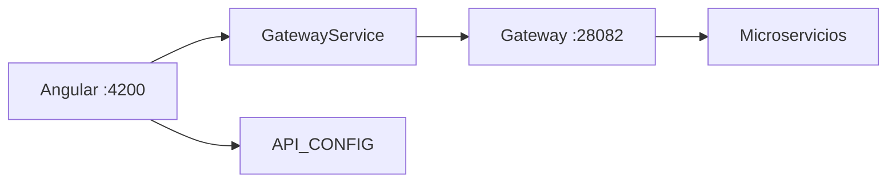

# Frontend Angular

## Estado actual

La rama `frontend_Smart` incorpora el cliente web de SmartCampus Marketplace con Angular 20. El frontend consume siempre el Gateway y centraliza rutas HTTP en `frontend/src/app/core/config/api.config.ts`.

| Elemento | Valor |
|---|---|
| Framework | Angular `20.3.x` |
| Lenguaje | TypeScript `5.9.x` |
| Estado | Integrado con Gateway, auth, publicaciones, pagos y chat |
| Rama fuente | `frontend_Smart` |
| Commit analizado | `d15999e` |

---

## Rutas de pantalla

| Ruta Angular | Pantalla | Protección |
|---|---|---|
| `/` | Home / catálogo | Pública |
| `/listing/:id` | Detalle de publicación | Pública |
| `/login` | Inicio de sesión | `guestGuard` |
| `/register` | Registro | `guestGuard` |
| `/publish` | Publicar producto | `authGuard` |
| `/profile` | Perfil del usuario | `authGuard` |
| `/chat` | Conversaciones | `authGuard` |
| `/payment-result` | Resultado de pago | Pública |
| `/pago/exito` | Retorno exitoso Mercado Pago | Pública |
| `/pago/fallo` | Retorno fallido Mercado Pago | Pública |
| `/pago/error` | Error de pago | Pública |
| `/pago/pendiente` | Pago pendiente | Pública |

También existen redirecciones de compatibilidad:

| Ruta antigua | Redirección |
|---|---|
| `/publicar` | `/publish` |
| `/publicacion/:id` | `/listing/:id` |
| `/registro` | `/register` |

---

## Integración con Gateway



`GatewayService` resuelve la URL activa del Gateway. En desarrollo, la configuración actual apunta al candidato `http://localhost:28082` cuando no se habilita sondeo.

```typescript
gatewayCandidates: [
  { label: 'DEV', url: '' },
  { label: 'PROD', url: 'http://localhost:28082' }
]
```

---

## Endpoints consumidos

| Dominio | Endpoint base |
|---|---|
| Auth | `/auth/login`, `/auth/register`, `/auth/me`, `/auth/profile` |
| Productos | `/api/v1/productos` |
| Categorías | `/api/v1/categorias` |
| Órdenes | `/api/v1/ordenes` |
| Pagos | `/api/v1/pagos` |
| Mercado Pago | `/api/v1/pagos/mercadopago/preference`, `/confirmar` |
| Chat | `/api/v1/chats` |
| Media | `/api/v1/media` |
| Favoritos | `/api/v1/favoritos` |
| Calificaciones | `/api/v1/calificaciones` |
| Publicaciones | `/api/v1/publicaciones` |

---

## Seguridad en cliente

El frontend usa `SessionService` para conservar la sesión y `authTokenInterceptor` para adjuntar:

```http
Authorization: Bearer <accessToken>
```

El interceptor no agrega token en endpoints públicos de login, registro y lecturas públicas de catálogo. Ante `401`, limpia sesión y redirige a `/login`.

---

## Comandos

```powershell
cd frontend
npm install
npm start
```

```bash
cd frontend
npm install
npm start
```

Pruebas:

```powershell
npm test
npm run e2e
```

```bash
npm test
npm run e2e
```

---

## Archivos principales

| Archivo | Uso |
|---|---|
| `frontend/src/app/app.routes.ts` | Rutas y guards |
| `frontend/src/app/core/config/api.config.ts` | Contrato de endpoints |
| `frontend/src/app/core/services/gateway.service.ts` | Resolución del Gateway |
| `frontend/src/app/core/interceptors/auth-token.interceptor.ts` | Bearer token y manejo 401 |
| `frontend/src/app/core/services/pago-api.service.ts` | Checkout y Mercado Pago |
| `frontend/src/app/core/services/chat.service.ts` | Conversaciones y mensajes |
| `frontend/src/environments/environment*.ts` | Configuración por ambiente |
