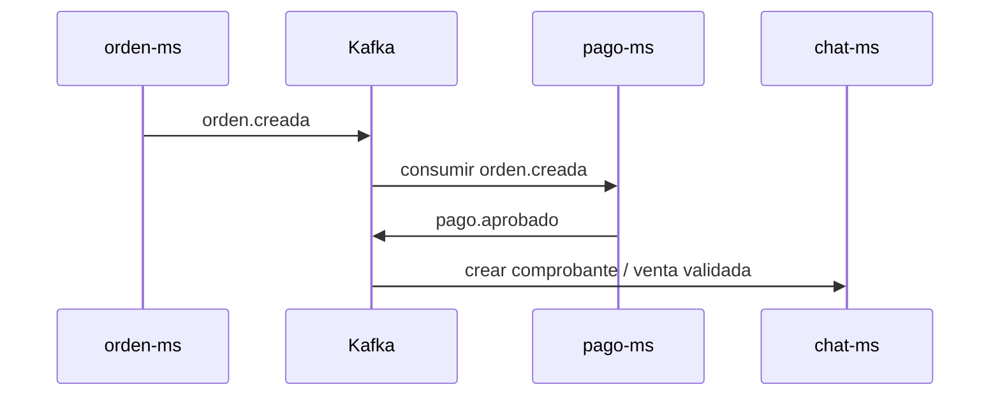

# Kafka y eventos

## Propósito

Kafka desacopla procesos que no deben bloquear el flujo principal del usuario, como pagos, evidencia en chat, auditoría o consistencia eventual entre órdenes y pagos.

---

## Flujo principal



---

## Servicios productores y consumidores

| Servicio | Rol Kafka | Archivos |
|---|---|---|
| `orden-ms` | Productor de `EventoOrden` | `KafkaConfiguracion.java`, `ProductorOrden.java` |
| `pago-ms` | Consumidor de orden y productor de pago | `ConsumidorPago.java`, `ProductorPago.java` |
| `chat-ms` | Consumidor de `pago.aprobado` | `ConsumidorPagoAprobado.java`, `KafkaConfiguracion.java` |

---

## Configuración

En DEV:

```yaml
spring:
  kafka:
    bootstrap-servers: localhost:41092
```

En PROD:

```yaml
spring:
  kafka:
    bootstrap-servers: ${KAFKA_BOOTSTRAP_SERVERS:kafka:9092}
```

---

## Verificación

```powershell
docker compose -f kafka/compose.yml up -d
curl http://localhost:28085
```

```bash
docker compose -f kafka/compose.yml up -d
curl http://localhost:28085
```

---

## Eventos de dominio propuestos

| Evento | Productor | Consumidor | Uso |
|---|---|---|---|
| `orden.creada` | `orden-ms` | `pago-ms` | Iniciar pago o dejar Mercado Pago pendiente |
| `pago.aprobado` | `pago-ms` | `chat-ms` | Crear comprobante y mensaje de venta validada |

---

## Idempotencia

`chat-ms` usa índices únicos para no duplicar mensajes de confirmación:

| Índice | Propósito |
|---|---|
| `ux_mensajes_confirmacion_pago` | Un comprobante por conversación, orden y tipo de mensaje |
| `ux_mensajes_venta_validada` | Una venta validada por conversación, orden, pago y `mp_payment_id` |
