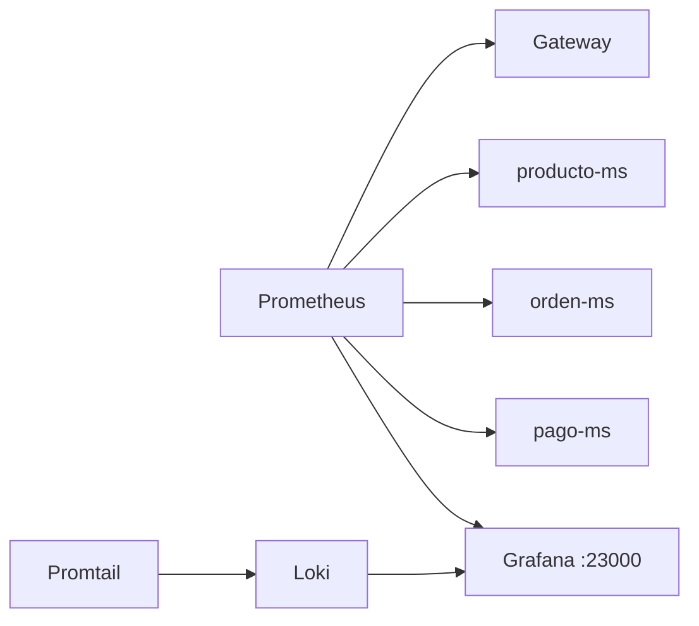

# Observabilidad

## Stack

| Herramienta | Puerto | Uso |
|---|---:|---|
| Actuator | Por servicio | Health, info, métricas |
| Prometheus | Interno / Compose | Scraping de métricas |
| Loki | Interno / Compose | Almacenamiento de logs |
| Promtail | Interno / Compose | Recolección de logs |
| Grafana | `23000` | Dashboards |

---

## Arquitectura



---

## Endpoints útiles

| Endpoint | Uso |
|---|---|
| `/actuator/health` | Estado del servicio |
| `/actuator/info` | Información básica |
| `/actuator/prometheus` | Métricas para Prometheus |
| `/actuator/metrics` | Métricas disponibles |

---

## Comandos

```powershell
make compose-obs
curl http://localhost:28082/actuator/health
curl http://localhost:28082/actuator/prometheus
```

```bash
make compose-obs
curl http://localhost:28082/actuator/health
curl http://localhost:28082/actuator/prometheus
```

---

## Diagnóstico frecuente

| Síntoma | Posible causa | Acción |
|---|---|---|
| Prometheus no ve un servicio | Servicio no está en red Docker o endpoint no expuesto | Revisar `obs/prometheus/prometheus.yml` |
| Grafana no muestra logs | Promtail no encuentra rutas de logs | Revisar `obs/promtail/config.yml` |
| Health `DOWN` | Dependencia externa caída | Revisar Config, DB, Kafka o Keycloak |
| Métricas vacías | Falta Micrometer Prometheus | Revisar `pom.xml` |
