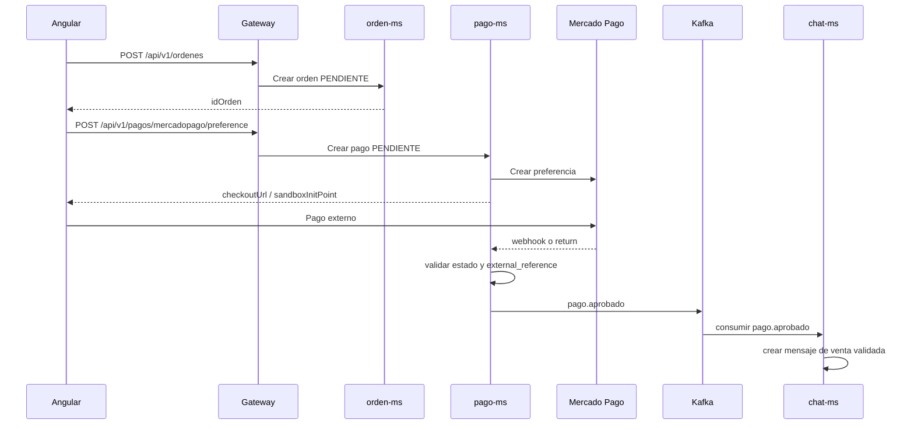

# Pagos Mercado Pago

## Propósito

El flujo de pagos permite crear una orden, generar una preferencia de Mercado Pago, confirmar o validar la transacción y registrar evidencia en el chat entre comprador y vendedor.

---

## Flujo principal



---

## Endpoints

| Método | Ruta | Uso |
|---|---|---|
| `POST` | `/api/v1/pagos/mercadopago/preference` | Crea preferencia Mercado Pago |
| `POST` | `/api/v1/pagos/mercadopago/webhook` | Recibe notificaciones de Mercado Pago |
| `GET` | `/api/v1/pagos/mercadopago/return` | Retorno y sincronización básica |
| `GET` | `/api/v1/pagos/mercadopago/confirmar` | Confirma pago por parámetros de retorno |
| `POST` | `/api/v1/pagos/{id}/validar-transaccion` | Valida manualmente `paymentId` |
| `GET` | `/api/v1/pagos/vendedor/{idVendedor}/resumen` | Resumen de ventas del vendedor |

---

## Request de preferencia

```json
{
  "idOrden": 10,
  "idComprador": 3,
  "publicacionId": 7,
  "idVendedor": 5,
  "titulo": "Calculadora científica",
  "descripcion": "Producto publicado en SmartCampus",
  "cantidad": 1,
  "precio": 45.5,
  "metodoPago": "MERCADO_PAGO"
}
```

Respuesta resumida:

```json
{
  "pagoId": 21,
  "idOrden": 10,
  "estado": "PENDIENTE",
  "preferenceId": "123456789",
  "sandboxInitPoint": "https://sandbox.mercadopago.com/..."
}
```

---

## Validación manual

Cuando el usuario regresa del checkout, el frontend puede pedir el número de transacción y enviarlo a:

```http
POST /api/v1/pagos/{pagoId}/validar-transaccion
Content-Type: application/json

{
  "paymentId": "123456789"
}
```

El backend valida que `external_reference` coincida con `ORDEN-{idOrden}` y evita aprobar dos pagos con el mismo `mp_payment_id`.

---

## Eventos y chat

Si Mercado Pago devuelve estado aprobado, `pago-ms` publica:

```json
{
  "tipoEvento": "pago.aprobado",
  "ordenId": 10,
  "pagoId": 21,
  "estado": "APROBADO",
  "origen": "mercado-pago-validacion-manual"
}
```

`chat-ms` consume el evento y crea un mensaje automático de venta validada. Además expone:

| Método | Ruta | Uso |
|---|---|---|
| `POST` | `/api/v1/chats/comprobantes` | Crear comprobante de pago en chat |
| `POST` | `/api/v1/chats/mensaje-venta-validada` | Crear mensaje idempotente de venta validada |

---

## Migraciones relacionadas

| Servicio | Migración | Cambio |
|---|---|---|
| `orden-ms` | `V4__add_metodo_pago_to_ordenes.sql` | Agrega `metodo_pago` e `id_vendedor` |
| `pago-ms` | `V7__add_chat_id_to_pagos.sql` | Relaciona pago con conversación |
| `pago-ms` | `V8__manual_payment_validation_fields.sql` | Guarda confirmación y evita duplicados por `mp_payment_id` |
| `chat-ms` | `V2__venta_chat_metadata.sql` | Agrega metadatos de venta y unicidad de mensajes |

---

## Variables

| Variable | Uso |
|---|---|
| `MP_ACCESS_TOKEN` | Token privado de Mercado Pago |
| `MP_PUBLIC_KEY` | Llave pública para frontend o referencia |
| `MP_NOTIFICATION_URL` | URL pública del webhook |
| `MP_SUCCESS_URL` | Retorno exitoso |
| `MP_FAILURE_URL` | Retorno fallido |
| `MP_PENDING_URL` | Retorno pendiente |
| `FRONTEND_URL` | Base URL del frontend |

!!! danger "Seguridad"
    No publicar tokens reales de Mercado Pago ni valores de producción en la documentación o en archivos versionados.
