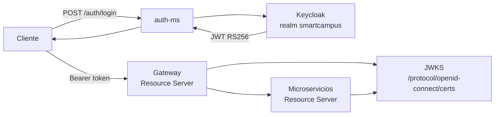

# Seguridad Keycloak y JWT

## Modelo de seguridad

SmartCampus usa Keycloak como autoridad de identidad. El realm principal es `smartcampus`.



---

## Configuración base

La configuración se hereda desde `infra/config/config-repo/application-dev.yml` y `application-prod.yml`.

```yaml
spring:
  security:
    oauth2:
      resourceserver:
        jwt:
          issuer-uri: ${KEYCLOAK_URL:http://localhost:8080}/realms/smartcampus
          jwk-set-uri: ${KEYCLOAK_URL:http://localhost:8080}/realms/smartcampus/protocol/openid-connect/certs
```

---

## Roles de dominio

| Rol | Usuario demo | Permisos esperados |
|---|---|---|
| `ESTUDIANTE` | `estudiante@upeu.edu.pe` | Comprar, favoritos, chat |
| `VENDEDOR` | `vendedor@upeu.edu.pe` | Publicar y administrar sus productos |
| `ADMIN` | `admin@upeu.edu.pe` | CRUD completo y configuración |

---

## Rutas públicas y privadas

| Ruta | Estado esperado |
|---|---|
| `/auth/login` | Pública |
| `/auth/register` | Pública |
| `/actuator/health` | Pública |
| Lectura de productos, categorías, publicaciones y media | Pública o con Bearer opcional |
| Swagger | Pública o restringida según ambiente |
| Escritura, borrado, pagos y administración | Protegidas por rol |

---

## Seguridad en frontend

El cliente Angular de `frontend_Smart` usa:

| Archivo | Responsabilidad |
|---|---|
| `frontend/src/app/guards/auth.guard.ts` | Protege `/publish`, `/profile` y `/chat` |
| `frontend/src/app/guards/guest.guard.ts` | Evita login/registro cuando ya existe sesión |
| `frontend/src/app/core/interceptors/auth-token.interceptor.ts` | Adjunta `Authorization: Bearer <token>` |
| `frontend/src/app/core/services/session.service.ts` | Persiste sesión y controla expiración |

El interceptor evita adjuntar token a login/registro y a lecturas públicas de catálogo, pero lo agrega a operaciones privadas como publicar, favoritos, chat, órdenes y pagos.

---

## Prueba manual

```http
POST http://localhost:28082/auth/login
Content-Type: application/json

{
  "username": "usuario-demo",
  "password": "clave-demo"
}
```

Respuesta esperada:

```json
{
  "accessToken": "<jwt>",
  "tokenType": "Bearer"
}
```

Uso del token:

```powershell
curl -H "Authorization: Bearer <jwt>" http://localhost:28082/api/v1/productos
```

```bash
curl -H "Authorization: Bearer <jwt>" http://localhost:28082/api/v1/productos
```

---

## Archivos clave

| Archivo | Función |
|---|---|
| `keycloak/compose.yml` | Levanta Keycloak |
| `infra/gateway/src/main/java/com/upeu/gateway/config/SecurityConfig.java` | Seguridad del Gateway |
| `servicio/*/config/SecurityConfig.java` | Seguridad por microservicio |
| `infra/config/config-repo/application-*.yml` | Issuer y JWKS compartidos |
| `servicio/auth-ms/src/main/java/com/upeu/auth/controller/AuthController.java` | Login |
