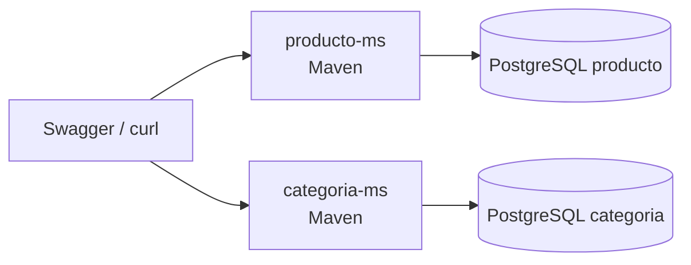
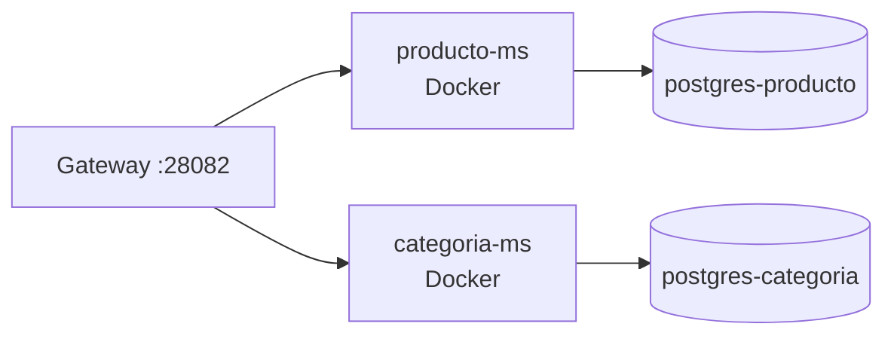

# S01 — Construcción de servicio base REST funcional y persistente

> En esta sesión se valida la base REST de SmartCampus Marketplace. El objetivo es que un servicio de dominio pueda exponer endpoints, persistir datos y responder por Gateway en el contexto universitario.

---

## 1. Introducción
> Tiempo estimado: 20 min

### 1.1 Propósito
Implementar y comprobar un microservicio REST persistente usando Spring Boot, PostgreSQL, Flyway, DTOs y capas separadas.

### 1.2 Resultado de aprendizaje
El estudiante construye un servicio REST independiente, observable y preparado para integrarse en una arquitectura distribuida.

### 1.3 Producto de sesión
`categoria-ms` y `producto-ms` funcionando con CRUD, validación, Swagger, Actuator y persistencia PostgreSQL.

### 1.4 Motivación de la sesión
Un estudiante necesita publicar o buscar productos dentro de la UPeU. Antes de implementar compras, pagos o chat, el sistema debe tener servicios base capaces de gestionar categorías y productos de forma confiable.

### 1.5 Ubicación en el curso
- Unidad: U1 — Sistema distribuido base.
- Producto de unidad: microservicios REST funcionales y persistentes.
- Avance del producto en esta sesión: primer bloque de negocio del marketplace universitario.

---

## 2. Explica
> Tiempo estimado: 15 min

### 2.1 Conceptos clave

| Concepto | Aplicación en SmartCampus |
|---|---|
| Entidad | `Producto`, `Categoria` |
| DTO | `ProductoRequest`, `ProductoResponse` |
| Repository | Acceso a PostgreSQL |
| Service | Reglas de negocio |
| Controller | Endpoints HTTP |
| Flyway | Migraciones SQL por servicio |

### 2.2 Arquitectura del sistema en esta sesión

#### 2.2.1 Entorno DEV (Maven local)



#### 2.2.2 Entorno PROD local (Docker Compose)



### 2.3 Observabilidad y diagnóstico
Revisar logs de arranque, `/actuator/health`, Swagger y migraciones Flyway. Si falla la conexión, verificar `DB_HOST`, `DB_NAME`, `DB_USER`, `DB_PASS` y el compose del servicio.

---

## 3. Aplica — Actividad práctica guiada

### 3.1 Compilar un servicio base

```bash
mvn -f servicio/producto-ms/pom.xml -DskipTests compile
```

```powershell
mvn -f servicio/producto-ms/pom.xml -DskipTests compile
```

Resultado esperado: compilación sin errores.

### 3.2 Levantar infraestructura y servicio

```bash
make compose-infra
make compose-ms MS=categoria-ms
make compose-ms MS=producto-ms
```

```powershell
make compose-infra
make compose-ms MS=categoria-ms
make compose-ms MS=producto-ms
```

### 3.3 Probar endpoint por Gateway

```bash
curl http://localhost:28082/api/v1/productos
```

```powershell
curl http://localhost:28082/api/v1/productos
```

### 3.4 Tabla de archivos trabajados

| Archivo | Uso |
|---|---|
| `servicio/producto-ms/src/main/java/com/upeu/producto/controller/ProductoController.java` | Endpoints de productos |
| `servicio/producto-ms/src/main/java/com/upeu/producto/service/impl/ProductoServiceImpl.java` | Reglas de negocio |
| `servicio/producto-ms/src/main/resources/application.yml` | Bootstrap Config Server |
| `servicio/producto-ms/compose.yml` | Despliegue Docker |
| `infra/config/config-repo/producto-ms-dev.yml` | Configuración DEV |

---

## 4. Crea — Actividad autónoma

Documenta un endpoint adicional del servicio elegido con método, ruta, request, response y código HTTP esperado.

---

## 5. Cierre evaluativo

### Checklist
- [ ] El servicio compila.
- [ ] El servicio tiene endpoint REST funcional.
- [ ] La persistencia está separada por servicio.
- [ ] El endpoint responde por Gateway.
- [ ] La sesión queda documentada con comandos reales.

### Pregunta de defensa
¿Por qué un microservicio debe tener su propia base de datos y no acceder directamente a la base de otro servicio?
