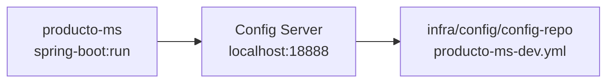
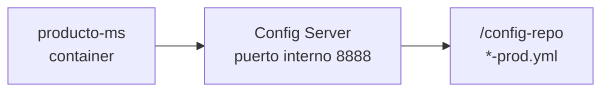

# S02 — Gestión centralizada de configuración y ambientes

> Esta sesión separa configuración de código. SmartCampus usa Config Server para administrar valores DEV y PROD de Gateway, Eureka, Keycloak, bases de datos y microservicios.

---

## 1. Introducción
> Tiempo estimado: 20 min

### 1.1 Propósito
Centralizar la configuración del sistema en `infra/config/config-repo`.

### 1.2 Resultado de aprendizaje
El estudiante configura servicios Spring Boot para leer propiedades externas por ambiente.

### 1.3 Producto de sesión
Config Server operativo en `infra/config` entregando archivos `*-dev.yml` y `*-prod.yml`.

### 1.4 Motivación de la sesión
En un marketplace universitario, los servicios no deben tener URLs, credenciales ni puertos rígidos dentro del código. La configuración debe poder cambiar entre laboratorio, producción local y despliegue.

### 1.5 Ubicación en el curso
- Unidad: U1 — Sistema distribuido base.
- Producto de unidad: configuración externa reproducible.
- Avance del producto en esta sesión: todos los servicios cargan configuración desde un punto central.

---

## 2. Explica
> Tiempo estimado: 15 min

### 2.1 Conceptos clave

| Concepto | Uso |
|---|---|
| Config Server | Publica YAML centralizados |
| `config-repo` | Carpeta con propiedades por servicio |
| Perfil `dev` | Maven local y servicios auxiliares en Docker |
| Perfil `prod` | Contenedores Docker y nombres internos |
| `spring.config.import` | Vincula servicio con Config Server |

### 2.2 Arquitectura del sistema en esta sesión

#### 2.2.1 Entorno DEV (Maven local)



#### 2.2.2 Entorno PROD local (Docker Compose)



### 2.3 Observabilidad y diagnóstico
Probar Config Server con `/actuator/health` y consultando un archivo de configuración publicado. En Maven local usa `18888`; en Docker Compose el puerto host publicado es `28888`.

---

## 3. Aplica — Actividad práctica guiada

### 3.1 Levantar Config Server

```bash
docker compose -f infra/compose.yml up -d config
```

```powershell
docker compose -f infra/compose.yml up -d config
```

### 3.2 Verificar health

```bash
curl http://localhost:28888/actuator/health
```

```powershell
curl http://localhost:28888/actuator/health
```

### 3.3 Consultar configuración de un servicio

```bash
curl http://localhost:28888/producto-ms/dev
```

```powershell
curl http://localhost:28888/producto-ms/dev
```

### 3.4 Tabla de archivos trabajados

| Archivo | Uso |
|---|---|
| `infra/config/src/main/resources/application.yml` | Configuración del Config Server |
| `infra/config/config-repo/application-dev.yml` | Seguridad común DEV |
| `infra/config/config-repo/gateway-dev.yml` | Rutas Gateway DEV |
| `infra/config/config-repo/producto-ms-dev.yml` | Configuración de producto |
| `servicio/producto-ms/src/main/resources/application.yml` | Importa Config Server |

---

## 4. Crea — Actividad autónoma

Agrega una propiedad `info.app.description` a un servicio y verifícala desde `/actuator/info`.

---

## 5. Cierre evaluativo

### Checklist
- [ ] Config Server responde health.
- [ ] Un servicio consulta su YAML remoto.
- [ ] Existen perfiles DEV y PROD.
- [ ] No hay secretos reales en el código.

### Pregunta de defensa
¿Qué problema aparece si cada microservicio mantiene sus URLs y credenciales dentro del `application.yml` local?
