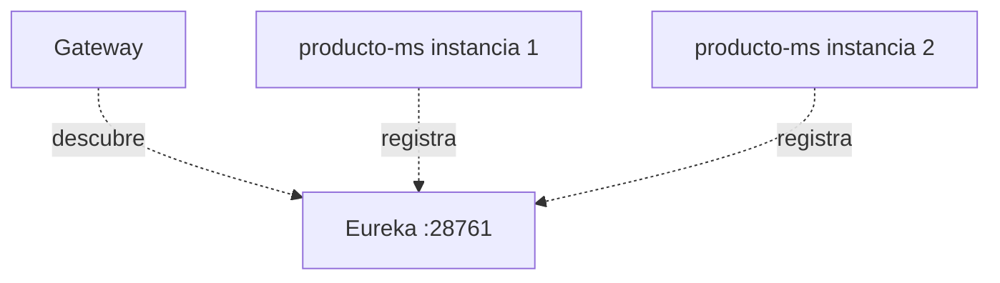
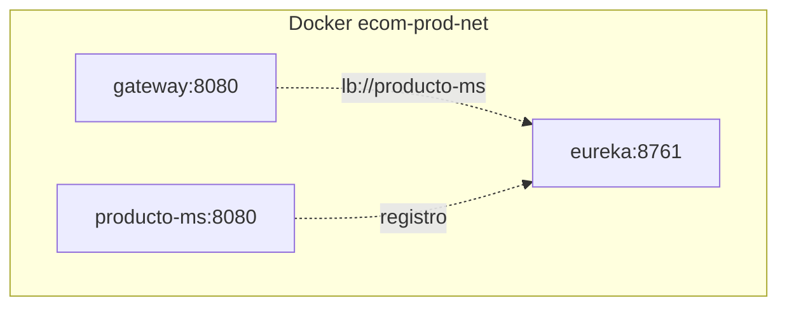

# S03 — Registro, descubrimiento y ejecución concurrente con Eureka

> En esta sesión los microservicios dejan de depender de URLs fijas y se registran en Eureka. El Gateway podrá resolver servicios por nombre lógico usando `lb://`.

---

## 1. Introducción
> Tiempo estimado: 20 min

### 1.1 Propósito
Registrar infraestructura y microservicios en Eureka para permitir descubrimiento dinámico.

### 1.2 Resultado de aprendizaje
El estudiante ejecuta varias instancias de servicios y entiende cómo Gateway y Feign las descubren.

### 1.3 Producto de sesión
Eureka en `infra/eureka` mostrando `gateway`, `auth-ms`, `producto-ms`, `catalogo-ms` y otros servicios activos.

### 1.4 Motivación de la sesión
Si en campaña universitaria muchos estudiantes consultan productos a la vez, el sistema debe permitir múltiples instancias y balanceo sin cambiar el cliente.

### 1.5 Ubicación en el curso
- Unidad: U1 — Sistema distribuido base.
- Producto de unidad: servicios registrados y descubiertos dinámicamente.
- Avance del producto en esta sesión: comunicación por nombre lógico.

---

## 2. Explica
> Tiempo estimado: 15 min

### 2.1 Conceptos clave

| Concepto | Uso |
|---|---|
| Eureka Server | Registro de instancias |
| Eureka Client | Microservicio registrado |
| `spring.application.name` | Nombre lógico del servicio |
| `lb://` | URI balanceada por Spring Cloud |
| Instance ID | Identifica instancias concurrentes |

### 2.2 Arquitectura del sistema en esta sesión

#### 2.2.1 Entorno DEV (Maven local)



#### 2.2.2 Entorno PROD local (Docker Compose)



### 2.3 Observabilidad y diagnóstico
Abrir `http://localhost:28761` y verificar que los servicios aparezcan con estado `UP`.

---

## 3. Aplica — Actividad práctica guiada

### 3.1 Levantar Eureka

```bash
docker compose -f infra/compose.yml up -d eureka
```

```powershell
docker compose -f infra/compose.yml up -d eureka
```

### 3.2 Ver dashboard

```bash
curl http://localhost:28761
```

```powershell
curl http://localhost:28761
```

### 3.3 Revisar rutas `lb://`

```bash
grep -n "lb://" infra/config/config-repo/gateway-dev.yml
```

```powershell
Select-String -Path infra/config/config-repo/gateway-dev.yml -Pattern "lb://"
```

### 3.4 Tabla de archivos trabajados

| Archivo | Uso |
|---|---|
| `infra/eureka/pom.xml` | Dependencias Eureka Server |
| `infra/eureka/src/main/resources/application.yml` | Bootstrap del registro |
| `infra/config/config-repo/eureka-dev.yml` | Perfil DEV de Eureka |
| `infra/config/config-repo/gateway-dev.yml` | Rutas `lb://` |
| `servicio/*/src/main/resources/application.yml` | Cliente Config/Eureka |

---

## 4. Crea — Actividad autónoma

Ejecuta dos instancias de un servicio y demuestra en Eureka que ambas aparecen registradas.

---

## 5. Cierre evaluativo

### Checklist
- [ ] Eureka está activo.
- [ ] Gateway está registrado.
- [ ] Al menos un microservicio aparece `UP`.
- [ ] Las rutas del Gateway usan `lb://`.

### Pregunta de defensa
¿Por qué `lb://producto-ms` es más mantenible que configurar una IP fija?
