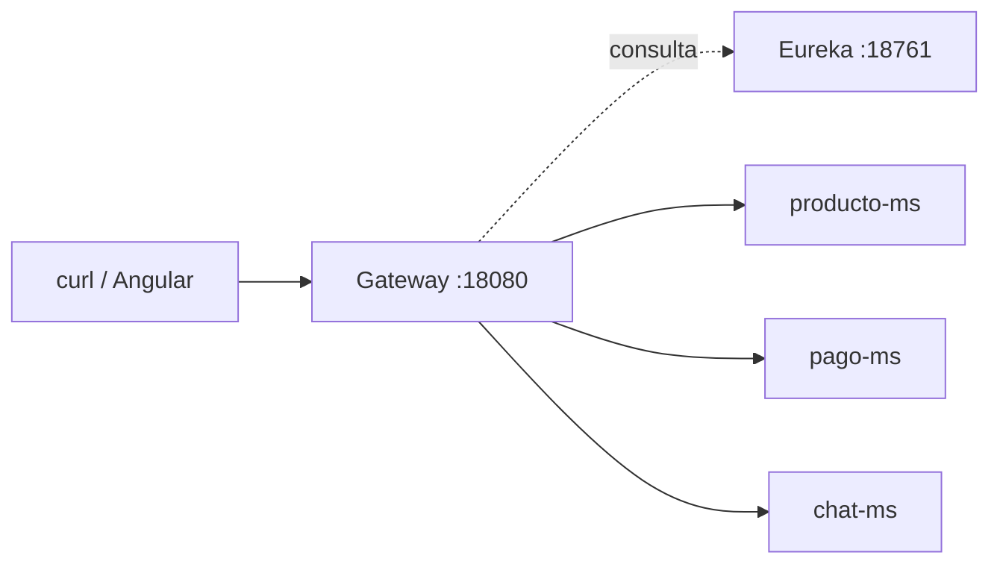
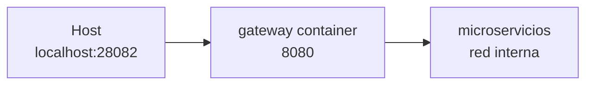

# S04 — Punto único de acceso y distribución de tráfico con Gateway

> En esta sesión se consolida el Gateway como entrada única del marketplace. El cliente deja de conocer puertos internos y consume rutas de negocio por `localhost:28082`.

---

## 1. Introducción
> Tiempo estimado: 20 min

### 1.1 Propósito
Configurar Spring Cloud Gateway para enrutar solicitudes a microservicios registrados en Eureka.

### 1.2 Resultado de aprendizaje
El estudiante diseña rutas centralizadas, verifica balanceo y entiende el rol del Gateway en seguridad y CORS.

### 1.3 Producto de sesión
`infra/gateway` operativo con rutas a `auth-ms`, `categoria-ms`, `producto-ms`, `publicacion-ms`, `media-ms`, `favoritos-ms`, `calificacion-ms`, `chat-ms`, `orden-ms` y `pago-ms`.

### 1.4 Motivación de la sesión
El frontend universitario debe usar una sola URL. Si cada microservicio expusiera su puerto, el cliente sería frágil e inseguro.

### 1.5 Ubicación en el curso
- Unidad: U1 — Sistema distribuido base.
- Producto de unidad: punto único de acceso.
- Avance del producto en esta sesión: consumo externo por Gateway.

---

## 2. Explica
> Tiempo estimado: 15 min

### 2.1 Conceptos clave

| Concepto | Uso |
|---|---|
| Gateway | Entrada HTTP única |
| Route | Regla de enrutamiento |
| Predicate `Path` | Decide por ruta |
| Filter | Transforma request/response |
| CORS | Permite frontend autorizado |

### 2.2 Arquitectura del sistema en esta sesión

#### 2.2.1 Entorno DEV (Maven local)



#### 2.2.2 Entorno PROD local (Docker Compose)



### 2.3 Observabilidad y diagnóstico
Revisar `/actuator/health`, logs del Gateway y rutas en `infra/config/config-repo/gateway-dev.yml`.

---

## 3. Aplica — Actividad práctica guiada

### 3.1 Levantar Gateway

```bash
docker compose -f infra/compose.yml up -d gateway
```

```powershell
docker compose -f infra/compose.yml up -d gateway
```

### 3.2 Probar health

```bash
curl http://localhost:28082/actuator/health
```

```powershell
curl http://localhost:28082/actuator/health
```

### 3.3 Probar ruta de negocio

```bash
curl http://localhost:28082/api/v1/productos
```

```powershell
curl http://localhost:28082/api/v1/productos
```

### 3.4 Tabla de archivos trabajados

| Archivo | Uso |
|---|---|
| `infra/gateway/src/main/java/com/upeu/gateway/GatewayApplication.java` | Arranque Gateway |
| `infra/gateway/src/main/java/com/upeu/gateway/config/SecurityConfig.java` | Seguridad |
| `infra/gateway/src/main/java/com/upeu/gateway/config/CorsGlobalConfig.java` | CORS |
| `infra/config/config-repo/gateway-dev.yml` | Rutas DEV |
| `infra/config/config-repo/gateway-prod.yml` | Rutas PROD |
| `frontend/src/app/core/config/api.config.ts` | Endpoints consumidos por Angular |

---

## 4. Crea — Actividad autónoma

Agrega en la documentación una tabla de rutas para un microservicio nuevo y especifica si debe ser pública o protegida.

---

## 5. Cierre evaluativo

### Checklist
- [ ] Gateway responde health.
- [ ] Las rutas usan `lb://`.
- [ ] El cliente no consume microservicios por puertos internos.
- [ ] CORS está documentado.

### Pregunta de defensa
¿Qué ventajas tiene centralizar seguridad y rutas en Gateway?
