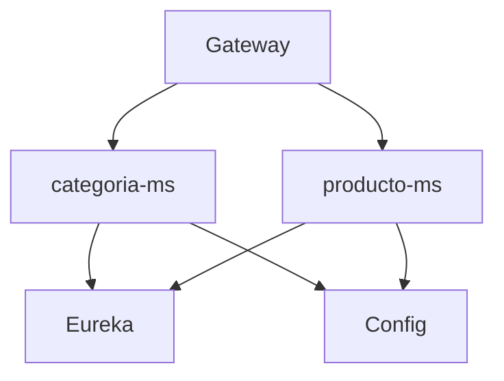
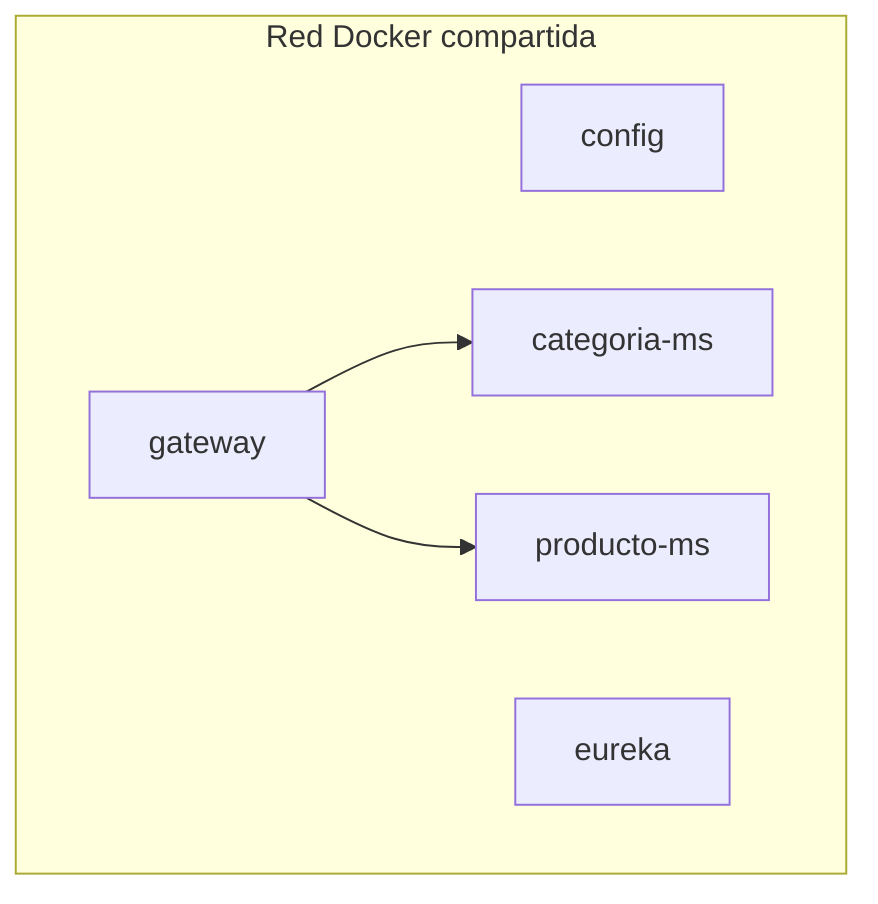

# S05 — Evaluación U1: sistema distribuido base

> Esta sesión integra lo construido en U1: servicios REST, configuración centralizada, Eureka y Gateway. La evidencia debe demostrar ejecución reproducible.

---

## 1. Introducción
> Tiempo estimado: 20 min

### 1.1 Propósito
Validar que la base distribuida de SmartCampus Marketplace funciona de extremo a extremo.

### 1.2 Resultado de aprendizaje
El estudiante demuestra un sistema base configurable, registrable y consumible por Gateway.

### 1.3 Producto de sesión
Infraestructura U1 ejecutándose con al menos `categoria-ms`, `producto-ms` y Gateway.

### 1.4 Motivación de la sesión
Antes de agregar seguridad, Kafka y observabilidad avanzada, el marketplace debe tener un núcleo estable y reproducible.

### 1.5 Ubicación en el curso
- Unidad: U1 — Sistema distribuido base.
- Producto de unidad: base distribuida funcional.
- Avance del producto en esta sesión: evidencia para evaluación parcial.

---

## 2. Explica
> Tiempo estimado: 15 min

### 2.1 Conceptos clave

| Criterio | Evidencia |
|---|---|
| REST persistente | CRUD de productos/categorías |
| Configuración | Config Server |
| Registro | Eureka dashboard |
| Gateway | Rutas `/api/v1/...` |
| Reproducibilidad | Makefile y Docker Compose |

### 2.2 Arquitectura del sistema en esta sesión

#### 2.2.1 Entorno DEV (Maven local)



#### 2.2.2 Entorno PROD local (Docker Compose)



### 2.3 Observabilidad y diagnóstico
Registrar capturas o salidas de health, Eureka y curl por Gateway.

---

## 3. Aplica — Actividad práctica guiada

### 3.1 Ejecutar infraestructura

```bash
make compose-infra
```

```powershell
make compose-infra
```

### 3.2 Ejecutar servicios base

```bash
make compose-ms MS=categoria-ms
make compose-ms MS=producto-ms
```

```powershell
make compose-ms MS=categoria-ms
make compose-ms MS=producto-ms
```

### 3.3 Evidencias mínimas

```bash
curl http://localhost:28082/actuator/health
curl http://localhost:28761
curl http://localhost:28082/api/v1/productos
```

```powershell
curl http://localhost:28082/actuator/health
curl http://localhost:28761
curl http://localhost:28082/api/v1/productos
```

### 3.4 Tabla de archivos trabajados

| Archivo | Evidencia |
|---|---|
| `README.md` | Inicio rápido |
| `Makefile` | Automatización |
| `infra/compose.yml` | Infraestructura |
| `infra/config/config-repo/gateway-dev.yml` | Rutas |
| `servicio/producto-ms/compose.yml` | Servicio de negocio |

---

## 4. Crea — Actividad autónoma

Redacta una evidencia con capturas de Gateway health, Eureka y una respuesta JSON de negocio.

---

## 5. Cierre evaluativo

### Checklist
- [ ] Config Server funciona.
- [ ] Eureka registra servicios.
- [ ] Gateway enruta.
- [ ] Al menos dos microservicios responden.
- [ ] Las evidencias están en la documentación.

### Pregunta de defensa
¿Qué pasaría si el Gateway funciona pero Eureka no registra `producto-ms`?
