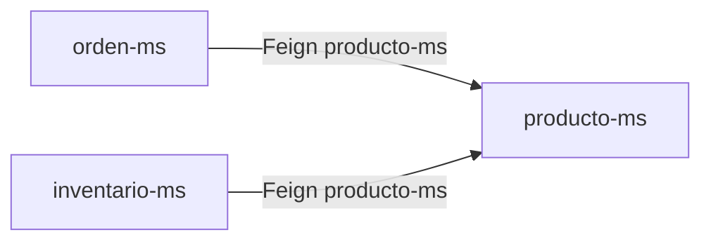
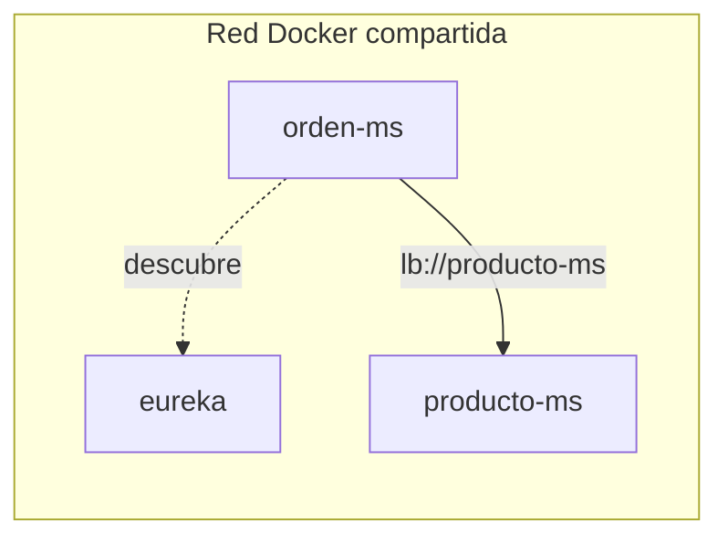

# S06 — Comunicación síncrona resiliente con Feign y Circuit Breaker

> Esta sesión conecta microservicios por HTTP interno. SmartCampus usa OpenFeign para consultas entre servicios y Resilience4j para controlar fallos.

---

## 1. Introducción
> Tiempo estimado: 20 min

### 1.1 Propósito
Implementar y documentar comunicación síncrona entre microservicios con fallback.

### 1.2 Resultado de aprendizaje
El estudiante consume otro microservicio por nombre Eureka y maneja errores sin tumbar el flujo principal.

### 1.3 Producto de sesión
Clientes Feign activos en `producto-ms`, `inventario-ms`, `carrito-ms`, `orden-ms` y `pago-ms`.

### 1.4 Motivación de la sesión
Una orden necesita validar productos y stock. Si `producto-ms` falla, el sistema debe responder de forma controlada y no colapsar toda la compra.

### 1.5 Ubicación en el curso
- Unidad: U2 — Sistema distribuido robusto.
- Producto de unidad: comunicación entre servicios con respuesta controlada ante fallos.
- Avance del producto en esta sesión: integración síncrona resiliente.

---

## 2. Explica
> Tiempo estimado: 15 min

### 2.1 Conceptos clave

| Concepto | Uso |
|---|---|
| OpenFeign | Cliente HTTP declarativo |
| Eureka | Resolución por nombre |
| Circuit Breaker | Evita cascada de fallos |
| Fallback | Respuesta alternativa |
| Correlation ID | Trazabilidad entre servicios |

### 2.2 Arquitectura del sistema en esta sesión

#### 2.2.1 Entorno DEV (Maven local)



#### 2.2.2 Entorno PROD local (Docker Compose)



### 2.3 Observabilidad y diagnóstico
Revisar logs con correlation id y endpoints `/actuator/circuitbreakers` cuando el servicio tenga Resilience4j configurado.

---

## 3. Aplica — Actividad práctica guiada

### 3.1 Ubicar clientes Feign

```bash
grep -R "@FeignClient" -n servicio
```

```powershell
Select-String -Path servicio/**/*.java -Pattern "@FeignClient"
```

### 3.2 Compilar servicios integrados

```bash
mvn -f servicio/orden-ms/pom.xml -DskipTests compile
mvn -f servicio/producto-ms/pom.xml -DskipTests compile
```

```powershell
mvn -f servicio/orden-ms/pom.xml -DskipTests compile
mvn -f servicio/producto-ms/pom.xml -DskipTests compile
```

### 3.3 Tabla de archivos trabajados

| Archivo | Uso |
|---|---|
| `servicio/orden-ms/src/main/java/com/upeu/ordenes/client/ProductoClient.java` | Feign hacia producto |
| `servicio/inventario-ms/src/main/java/com/upeu/inventario/client/ProductoClient.java` | Feign hacia producto |
| `servicio/producto-ms/src/main/java/com/upeu/producto/client/CatalogoClient.java` | Feign hacia catálogo |
| `servicio/*/config/FeignTraceConfig.java` | Propagación de trazas |

---

## 4. Crea — Actividad autónoma

Describe un escenario de fallo de `producto-ms` y qué debería responder `orden-ms`.

---

## 5. Cierre evaluativo

### Checklist
- [ ] Existe al menos un cliente Feign.
- [ ] La llamada usa nombre del servicio.
- [ ] Hay estrategia de fallback o error controlado.
- [ ] Se documenta impacto en negocio.

### Pregunta de defensa
¿Cuál es la diferencia entre una llamada Feign directa y una llamada balanceada con Eureka?
