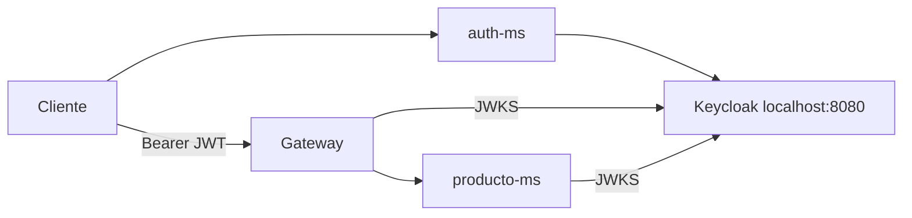
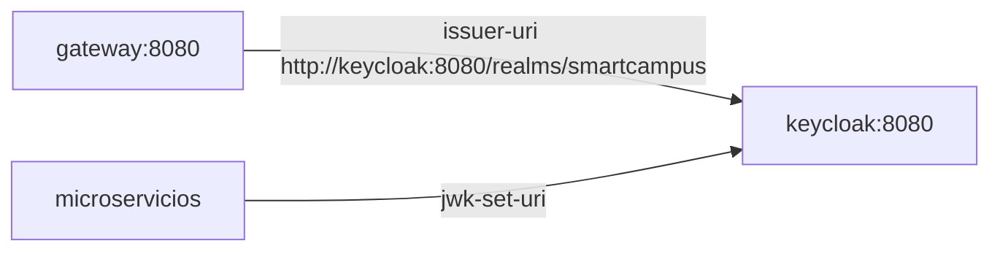

# S07 — Seguridad distribuida con Keycloak y JWT

> Esta sesión protege rutas y valida identidad. SmartCampus delega autenticación a Keycloak y valida tokens JWT con JWKS en Gateway y microservicios.

---

## 1. Introducción
> Tiempo estimado: 20 min

### 1.1 Propósito
Configurar seguridad distribuida con Keycloak, JWT y roles de dominio.

### 1.2 Resultado de aprendizaje
El estudiante protege endpoints, valida tokens y diferencia rutas públicas de rutas privadas.

### 1.3 Producto de sesión
`auth-ms`, Gateway y microservicios protegidos mediante `issuer-uri` y `jwk-set-uri`.

### 1.4 Motivación de la sesión
Solo usuarios UPeU autenticados deben comprar, publicar o administrar productos. Un vendedor no debe tener permisos de administrador.

### 1.5 Ubicación en el curso
- Unidad: U2 — Sistema distribuido robusto.
- Producto de unidad: seguridad distribuida con Keycloak + JWT.
- Avance del producto en esta sesión: protección de rutas críticas.

---

## 2. Explica
> Tiempo estimado: 15 min

### 2.1 Conceptos clave

| Concepto | Uso |
|---|---|
| Realm | `smartcampus` |
| Access token | JWT emitido por Keycloak |
| JWKS | Llaves públicas para validar firma |
| Resource Server | Gateway y microservicios |
| Roles | `ESTUDIANTE`, `VENDEDOR`, `ADMIN` |

### 2.2 Arquitectura del sistema en esta sesión

#### 2.2.1 Entorno DEV (Maven local)



#### 2.2.2 Entorno PROD local (Docker Compose)



### 2.3 Observabilidad y diagnóstico
Revisar errores 401, 403, issuer incorrecto y disponibilidad de `/.well-known/openid-configuration`.

---

## 3. Aplica — Actividad práctica guiada

### 3.1 Levantar Keycloak

```bash
make compose-keycloak
```

```powershell
make compose-keycloak
```

### 3.2 Validar realm

```bash
curl http://localhost:8080/realms/smartcampus/.well-known/openid-configuration
```

```powershell
curl http://localhost:8080/realms/smartcampus/.well-known/openid-configuration
```

### 3.3 Login por Gateway

```http
POST http://localhost:28082/auth/login
Content-Type: application/json

{
  "username": "estudiante@upeu.edu.pe",
  "password": "clave-demo"
}
```

### 3.4 Tabla de archivos trabajados

| Archivo | Uso |
|---|---|
| `keycloak/compose.yml` | Identidad |
| `servicio/auth-ms/src/main/java/com/upeu/auth/controller/AuthController.java` | Login |
| `infra/gateway/src/main/java/com/upeu/gateway/config/SecurityConfig.java` | Resource Server |
| `servicio/*/config/SecurityConfig.java` | Seguridad por servicio |
| `infra/config/config-repo/application-prod.yml` | Issuer y JWKS |

---

## 4. Crea — Actividad autónoma

Escribe una matriz de permisos para `ESTUDIANTE`, `VENDEDOR` y `ADMIN` sobre productos, órdenes y pagos.

---

## 5. Cierre evaluativo

### Checklist
- [ ] Keycloak responde.
- [ ] `auth-ms` permite login.
- [ ] Gateway valida token.
- [ ] Rutas privadas devuelven 401 sin token.
- [ ] Roles están documentados.

### Pregunta de defensa
¿Por qué el frontend no debe validar la seguridad final del sistema?
