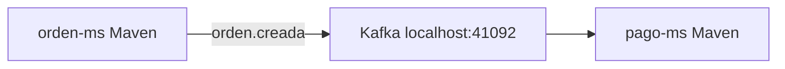
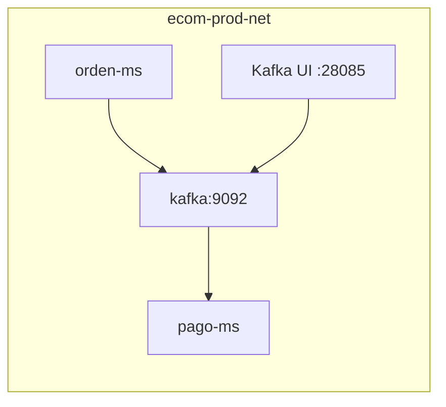

# S08 — Mensajería asíncrona entre servicios con Kafka

> Esta sesión desacopla procesos mediante eventos. Órdenes, pagos y notificaciones pueden reaccionar sin bloquear el flujo principal.

---

## 1. Introducción
> Tiempo estimado: 20 min

### 1.1 Propósito
Implementar mensajería asíncrona con Kafka entre servicios de negocio.

### 1.2 Resultado de aprendizaje
El estudiante publica y consume eventos entre microservicios desacoplados.

### 1.3 Producto de sesión
`orden-ms` publica `EventoOrden` y `pago-ms` consume/procesa eventos relacionados.

### 1.4 Motivación de la sesión
Cuando un estudiante crea una orden, el pago y la notificación pueden procesarse como eventos. Esto evita acoplar todo en una sola transacción HTTP.

### 1.5 Ubicación en el curso
- Unidad: U2 — Sistema distribuido robusto.
- Producto de unidad: mensajería asíncrona desacoplada.
- Avance del producto en esta sesión: eventos de orden y pago.

---

## 2. Explica
> Tiempo estimado: 15 min

### 2.1 Conceptos clave

| Concepto | Uso |
|---|---|
| Topic | Canal de eventos |
| Producer | Servicio que publica |
| Consumer | Servicio que reacciona |
| Consumer group | Grupo de consumo |
| Evento de dominio | Cambio importante del negocio |

### 2.2 Arquitectura del sistema en esta sesión

#### 2.2.1 Entorno DEV (Maven local)



#### 2.2.2 Entorno PROD local (Docker Compose)



### 2.3 Observabilidad y diagnóstico
Usar Kafka UI, logs de `orden-ms`, logs de `pago-ms` y métricas de Kafka exporter si está activo.

---

## 3. Aplica — Actividad práctica guiada

### 3.1 Levantar Kafka

```bash
make compose-kafka
```

```powershell
make compose-kafka
```

### 3.2 Abrir Kafka UI

```bash
curl http://localhost:28085
```

```powershell
curl http://localhost:28085
```

### 3.3 Ubicar productores y consumidores

```bash
grep -R "KafkaTemplate\\|@KafkaListener" -n servicio/orden-ms servicio/pago-ms
```

```powershell
Select-String -Path servicio/orden-ms/**/*.java,servicio/pago-ms/**/*.java -Pattern "KafkaTemplate","@KafkaListener"
```

### 3.4 Tabla de archivos trabajados

| Archivo | Uso |
|---|---|
| `kafka/compose.yml` | Broker y Kafka UI |
| `servicio/orden-ms/src/main/java/com/upeu/ordenes/service/ProductorOrden.java` | Productor |
| `servicio/pago-ms/src/main/java/com/upeu/pagos/service/ConsumidorPago.java` | Consumidor |
| `servicio/pago-ms/src/main/java/com/upeu/pagos/service/ProductorPago.java` | Evento de pago |
| `infra/config/config-repo/orden-ms-prod.yml` | Bootstrap Kafka |

---

## 4. Crea — Actividad autónoma

Diseña un evento `producto.publicado` para que `search-ms` indexe publicaciones nuevas.

---

## 5. Cierre evaluativo

### Checklist
- [ ] Kafka está activo.
- [ ] Existe productor.
- [ ] Existe consumidor.
- [ ] El topic se observa en Kafka UI.
- [ ] El evento contiene datos mínimos de negocio.

### Pregunta de defensa
¿Por qué un evento Kafka ayuda a desacoplar `orden-ms` de `pago-ms`?
