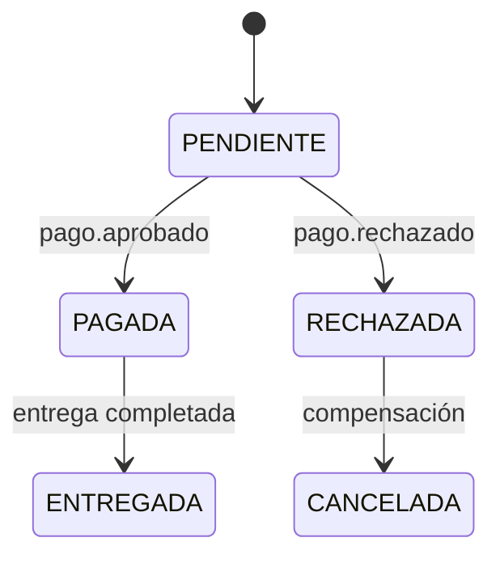
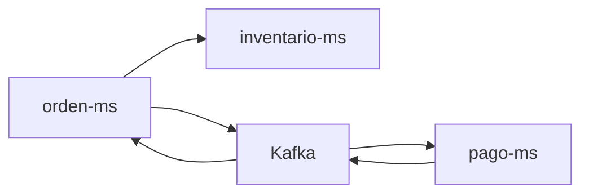

# S09 — Consistencia distribuida en procesos de negocio

> Esta sesión analiza cómo mantener coherencia entre orden, pago e inventario sin usar una base de datos compartida. El enfoque es consistencia eventual y compensación.

---

## 1. Introducción
> Tiempo estimado: 20 min

### 1.1 Propósito
Documentar y validar reglas de consistencia entre compra, stock y pago.

### 1.2 Resultado de aprendizaje
El estudiante identifica problemas de consistencia y propone compensaciones e idempotencia.

### 1.3 Producto de sesión
Flujo orden-pago-inventario documentado con estados, eventos y reglas de recuperación.

### 1.4 Motivación de la sesión
Si un estudiante paga una orden pero el stock no se descuenta, o si el stock se descuenta y el pago falla, el marketplace pierde confiabilidad.

### 1.5 Ubicación en el curso
- Unidad: U2 — Sistema distribuido robusto.
- Producto de unidad: consistencia eventual en procesos críticos.
- Avance del producto en esta sesión: diseño de estados y compensaciones.

---

## 2. Explica
> Tiempo estimado: 15 min

### 2.1 Conceptos clave

| Concepto | Aplicación |
|---|---|
| Consistencia eventual | Los servicios convergen después de eventos |
| Idempotencia | Procesar el mismo evento sin duplicar efectos |
| Compensación | Revertir o corregir si falla un paso |
| Estado de orden | `PENDIENTE`, `PAGADA`, `RECHAZADA`, `CANCELADA` |
| Estado de pago | `APROBADO`, `RECHAZADO` |

### 2.2 Arquitectura del sistema en esta sesión

#### 2.2.1 Entorno DEV (Maven local)



#### 2.2.2 Entorno PROD local (Docker Compose)



### 2.3 Observabilidad y diagnóstico
Revisar correlación entre logs de orden, pago y Kafka. Un mismo `ordenId` debe poder rastrearse en todo el flujo.

---

## 3. Aplica — Actividad práctica guiada

### 3.1 Crear una orden

```bash
curl -X POST http://localhost:28082/api/v1/ordenes \
  -H "Content-Type: application/json" \
  -H "Authorization: Bearer <jwt>" \
  -d '{"idComprador":1,"idProducto":1,"cantidad":1,"total":25.90}'
```

```powershell
curl -Method POST http://localhost:28082/api/v1/ordenes `
  -Headers @{ "Content-Type"="application/json"; "Authorization"="Bearer <jwt>" } `
  -Body '{"idComprador":1,"idProducto":1,"cantidad":1,"total":25.90}'
```

### 3.2 Revisar pagos asociados

```bash
curl -H "Authorization: Bearer <jwt>" http://localhost:28082/api/v1/pagos
```

```powershell
curl -Headers @{ "Authorization"="Bearer <jwt>" } http://localhost:28082/api/v1/pagos
```

### 3.3 Tabla de archivos trabajados

| Archivo | Uso |
|---|---|
| `servicio/orden-ms/src/main/java/com/upeu/ordenes/service/impl/OrdenServiceImpl.java` | Creación de orden |
| `servicio/orden-ms/src/main/java/com/upeu/ordenes/evento/EventoOrden.java` | Evento de orden |
| `servicio/pago-ms/src/main/java/com/upeu/pagos/evento/EventoPago.java` | Evento de pago |
| `servicio/inventario-ms/src/main/java/com/upeu/inventario/service/impl/InventarioServiceImpl.java` | Stock |

---

## 4. Crea — Actividad autónoma

Propón una regla idempotente para que `pago-ms` no registre dos pagos para la misma orden.

---

## 5. Cierre evaluativo

### Checklist
- [ ] El flujo tiene estados definidos.
- [ ] Hay eventos de dominio.
- [ ] Se documenta una compensación.
- [ ] Se define una regla idempotente.

### Pregunta de defensa
¿Por qué no conviene que `orden-ms` escriba directamente en la base de datos de `pago-ms`?
