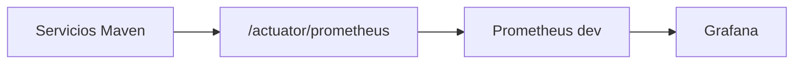
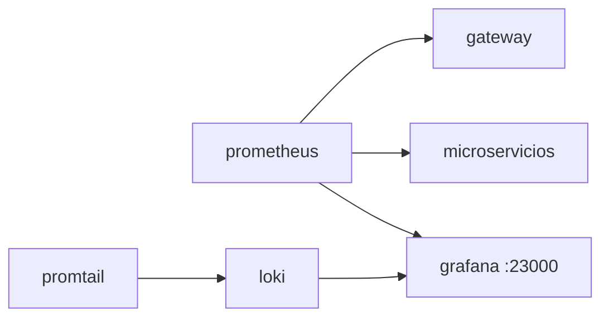

# S10 — Observabilidad y diagnóstico con Prometheus, Loki y Grafana

> Esta sesión permite diagnosticar el sistema distribuido desde métricas, health checks y logs centralizados. Lo importante no es solo que funcione, sino saber explicar por qué falla.

---

## 1. Introducción
> Tiempo estimado: 20 min

### 1.1 Propósito
Levantar y usar el stack de observabilidad del proyecto.

### 1.2 Resultado de aprendizaje
El estudiante interpreta health, métricas y logs para diagnosticar fallos en microservicios.

### 1.3 Producto de sesión
Prometheus, Loki, Promtail y Grafana funcionando desde `obs/`.

### 1.4 Motivación de la sesión
En un marketplace con muchos servicios, un error de compra puede originarse en Gateway, token, inventario, pago, Kafka o base de datos. La observabilidad permite encontrar la causa.

### 1.5 Ubicación en el curso
- Unidad: U2 — Sistema distribuido robusto.
- Producto de unidad: logs, métricas y paneles de diagnóstico.
- Avance del producto en esta sesión: monitoreo básico integrado.

---

## 2. Explica
> Tiempo estimado: 15 min

### 2.1 Conceptos clave

| Concepto | Uso |
|---|---|
| Health | Estado del servicio |
| Métrica | Medición numérica |
| Log | Evento textual de diagnóstico |
| Prometheus | Recolecta métricas |
| Loki | Almacena logs |
| Grafana | Visualiza métricas y logs |

### 2.2 Arquitectura del sistema en esta sesión

#### 2.2.1 Entorno DEV (Maven local)



#### 2.2.2 Entorno PROD local (Docker Compose)



### 2.3 Observabilidad y diagnóstico
Verificar `obs/prometheus/prometheus.yml`, `obs/promtail/config.yml` y datasource de Grafana.

---

## 3. Aplica — Actividad práctica guiada

### 3.1 Levantar observabilidad

```bash
make compose-obs
```

```powershell
make compose-obs
```

### 3.2 Probar métricas del Gateway

```bash
curl http://localhost:28082/actuator/prometheus
```

```powershell
curl http://localhost:28082/actuator/prometheus
```

### 3.3 Abrir Grafana

```bash
curl http://localhost:23000
```

```powershell
curl http://localhost:23000
```

### 3.4 Tabla de archivos trabajados

| Archivo | Uso |
|---|---|
| `obs/compose.yml` | Stack de observabilidad |
| `obs/prometheus/prometheus.yml` | Targets de scraping |
| `obs/loki/config.yml` | Configuración de Loki |
| `obs/promtail/config.yml` | Recolección de logs |
| `obs/grafana/provisioning/datasources/datasources.yml` | Datasources |

---

## 4. Crea — Actividad autónoma

Agrega al informe una captura o descripción de una métrica HTTP del Gateway y un log de un microservicio.

---

## 5. Cierre evaluativo

### Checklist
- [ ] Grafana abre.
- [ ] Prometheus scrapea al menos Gateway.
- [ ] Loki recibe logs.
- [ ] Se documenta un caso de diagnóstico.

### Pregunta de defensa
¿Qué diferencia hay entre una métrica y un log?
