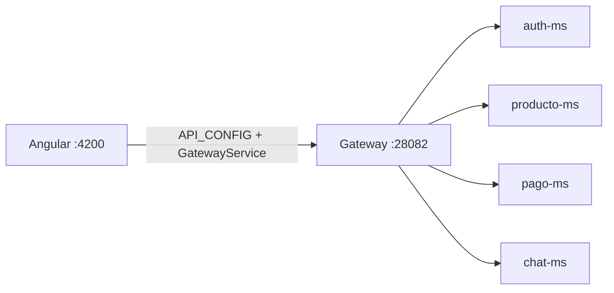
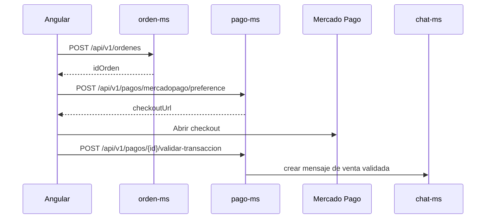

# S11 — Integración con cliente frontend Angular

> Esta sesión conecta el cliente Angular 20 de `frontend_Smart` con el Gateway. El frontend consume endpoints reales de autenticación, catálogo, publicación, pagos Mercado Pago, perfil y chat.

---

## 1. Introducción
> Tiempo estimado: 20 min

### 1.1 Propósito
Integrar Angular con Gateway, JWT, guards, servicios HTTP y flujos de negocio del marketplace.

### 1.2 Resultado de aprendizaje
El estudiante consume microservicios desde un frontend usando rutas centralizadas, sesión autenticada y token Bearer.

### 1.3 Producto de sesión
Frontend Angular con home, login, registro, publicación, detalle, perfil, chat y resultado de pago.

### 1.4 Motivación de la sesión
Los estudiantes, vendedores y administradores no usan curl; necesitan una interfaz web que respete roles y flujos reales de compra, publicación, pago y conversación.

### 1.5 Ubicación en el curso
- Unidad: U2 — Sistema distribuido robusto.
- Producto de unidad: cliente frontend integrado por Gateway.
- Avance del producto en esta sesión: experiencia web del marketplace.

---

## 2. Explica
> Tiempo estimado: 15 min

### 2.1 Conceptos clave

| Concepto | Uso |
|---|---|
| `GatewayService` | Resuelve URL base del Gateway |
| `API_CONFIG` | Centraliza rutas backend |
| `authTokenInterceptor` | Adjunta `Authorization: Bearer <token>` |
| `authGuard` | Protege publicar, perfil y chat |
| `guestGuard` | Protege login/registro cuando ya hay sesión |
| `PagoApiService` | Crea preferencia y valida transacción Mercado Pago |
| `ChatService` | Lista conversaciones y mensajes |

### 2.2 Arquitectura del sistema en esta sesión

#### 2.2.1 Entorno DEV



#### 2.2.2 Flujo de pago desde frontend



### 2.3 Observabilidad y diagnóstico
Revisar consola del navegador, errores 401/403, `GatewayService`, CORS del Gateway y health de `pago-ms`/`chat-ms`.

---

## 3. Aplica — Actividad práctica guiada

### 3.1 Instalar dependencias

```bash
cd frontend
npm install
```

```powershell
cd frontend
npm install
```

### 3.2 Ejecutar frontend

```bash
npm start
```

```powershell
npm start
```

Resultado esperado: Angular disponible en `http://localhost:4200`.

### 3.3 Verificar Gateway

```bash
curl http://localhost:28082/actuator/health
```

```powershell
curl http://localhost:28082/actuator/health
```

### 3.4 Revisar rutas Angular

```bash
grep -n "path:" frontend/src/app/app.routes.ts
```

```powershell
Select-String -Path frontend/src/app/app.routes.ts -Pattern "path:"
```

### 3.5 Tabla de archivos trabajados

| Archivo | Uso |
|---|---|
| `frontend/src/app/app.routes.ts` | Rutas de pantalla |
| `frontend/src/app/core/config/api.config.ts` | Endpoints del Gateway |
| `frontend/src/app/core/services/gateway.service.ts` | URL base y health probe |
| `frontend/src/app/core/interceptors/auth-token.interceptor.ts` | Bearer token |
| `frontend/src/app/core/services/pago-api.service.ts` | Mercado Pago |
| `frontend/src/app/core/services/chat.service.ts` | Conversaciones |
| `frontend/src/environments/environment*.ts` | Configuración por ambiente |

---

## 4. Crea — Actividad autónoma

Documenta una pantalla real del frontend con ruta, guard, servicio Angular usado y endpoint Gateway consumido.

---

## 5. Cierre evaluativo

### Checklist
- [ ] Angular arranca en `localhost:4200`.
- [ ] Gateway responde en `localhost:28082`.
- [ ] Login guarda sesión.
- [ ] Las rutas protegidas usan `authGuard`.
- [ ] El token se envía solo en requests privadas.
- [ ] El flujo de pago muestra resultado o validación.

### Pregunta de defensa
¿Por qué el frontend debe centralizar endpoints en `API_CONFIG` y no escribir URLs de microservicios en cada componente?
