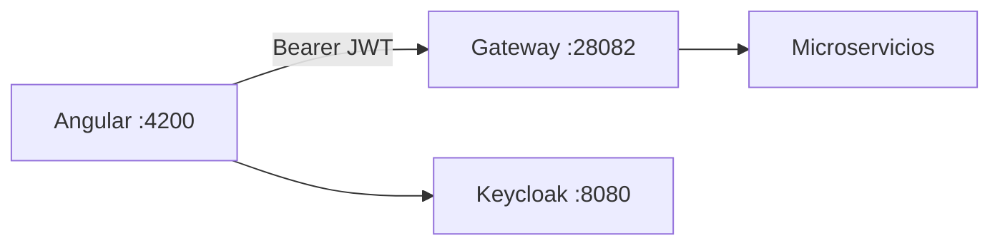
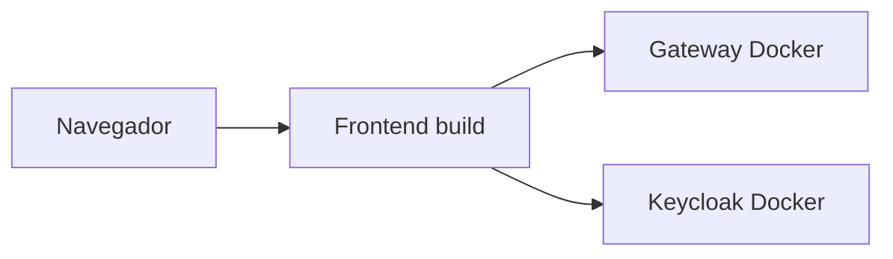

# S11 — Integración con cliente frontend Angular

> Esta sesión conecta el cliente web con el Gateway. En esta copia local no aparece carpeta `frontend/`, por lo que la documentación deja preparada la integración para la rama `frontend_Smart`.

---

## 1. Introducción
> Tiempo estimado: 20 min

### 1.1 Propósito
Integrar Angular con Gateway, Keycloak y endpoints de negocio.

### 1.2 Resultado de aprendizaje
El estudiante consume microservicios desde un frontend usando una URL base centralizada y token JWT.

### 1.3 Producto de sesión
Frontend Angular consumiendo `http://localhost:28082` y enviando `Authorization: Bearer <token>`.

### 1.4 Motivación de la sesión
Los estudiantes, vendedores y administradores no usan curl; necesitan una interfaz web que respete roles y flujos reales de compra, publicación y chat.

### 1.5 Ubicación en el curso
- Unidad: U2 — Sistema distribuido robusto.
- Producto de unidad: cliente frontend integrado por Gateway.
- Avance del producto en esta sesión: experiencia web del marketplace.

---

## 2. Explica
> Tiempo estimado: 15 min

### 2.1 Conceptos clave

| Concepto | Uso |
|---|---|
| `API_BASE_URL` | URL del Gateway |
| Interceptor | Agrega token JWT |
| Guard | Protege rutas frontend |
| CORS | Permite origen Angular |
| Roles | Controlan pantallas |

### 2.2 Arquitectura del sistema en esta sesión

#### 2.2.1 Entorno DEV (Maven local)



#### 2.2.2 Entorno PROD local (Docker Compose)



### 2.3 Observabilidad y diagnóstico
Revisar CORS en Gateway, errores 401/403 en consola web y health del Gateway.

---

## 3. Aplica — Actividad práctica guiada

### 3.1 Verificar si existe frontend local

```bash
find . -name package.json -not -path "*/node_modules/*"
```

```powershell
Get-ChildItem -Recurse -Filter package.json | Where-Object { $_.FullName -notmatch "node_modules" }
```

### 3.2 Configuración esperada

```typescript
export const API_BASE_URL = 'http://localhost:28082';
```

### 3.3 Probar Gateway antes del frontend

```bash
curl http://localhost:28082/actuator/health
```

```powershell
curl http://localhost:28082/actuator/health
```

### 3.4 Tabla de archivos trabajados

| Archivo | Uso |
|---|---|
| `infra/gateway/src/main/java/com/upeu/gateway/config/CorsGlobalConfig.java` | CORS para frontend |
| `infra/config/config-repo/gateway-dev.yml` | Rutas consumidas por Angular |
| `frontend/src/app/core/config/api.config.ts` | URL base esperada |
| `frontend/src/app/core/services` | Servicios HTTP esperados |

---

## 4. Crea — Actividad autónoma

Cuando la rama `frontend_Smart` esté disponible localmente, documenta las pantallas reales por rol y agrega una tabla de rutas Angular.

---

## 5. Cierre evaluativo

### Checklist
- [ ] Gateway responde.
- [ ] CORS permite el origen del frontend.
- [ ] El frontend usa Gateway, no microservicios directos.
- [ ] El token se envía en requests privadas.

### Pregunta de defensa
¿Por qué Angular debe consumir el Gateway y no cada microservicio por separado?
