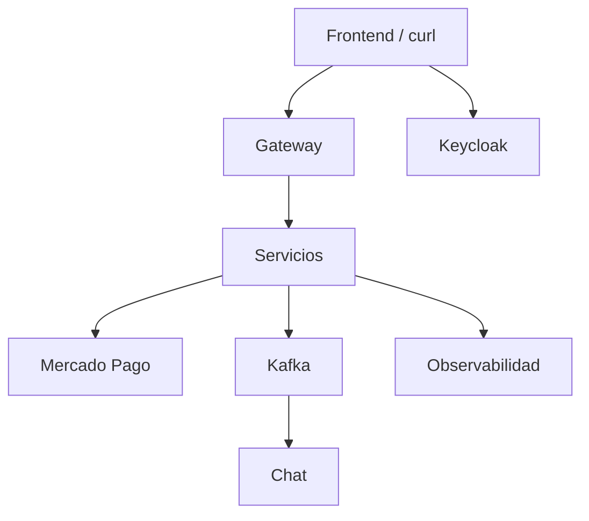
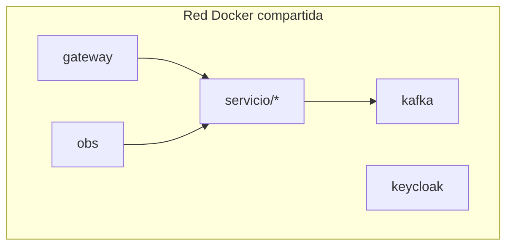

# S12 — Evaluación U2: sistema distribuido robusto

> Esta sesión valida seguridad, resiliencia, Kafka, consistencia, observabilidad y frontend. Es la evidencia de que SmartCampus supera la arquitectura base.

---

## 1. Introducción
> Tiempo estimado: 20 min

### 1.1 Propósito
Consolidar y demostrar los componentes robustos de U2.

### 1.2 Resultado de aprendizaje
El estudiante defiende un sistema seguro, resiliente, observable y parcialmente desacoplado por eventos.

### 1.3 Producto de sesión
Flujo autenticado con Gateway, Feign, Kafka, Mercado Pago, chat y observabilidad.

### 1.4 Motivación de la sesión
El marketplace no solo debe responder: debe resistir fallos, proteger datos y permitir diagnóstico.

### 1.5 Ubicación en el curso
- Unidad: U2 — Sistema distribuido robusto.
- Producto de unidad: sistema seguro, resiliente y observable.
- Avance del producto en esta sesión: entrega U2 defendible.

---

## 2. Explica
> Tiempo estimado: 15 min

### 2.1 Conceptos clave

| Área | Evidencia |
|---|---|
| Resiliencia | Feign y fallback |
| Seguridad | Keycloak + JWT |
| Kafka | Eventos orden/pago/chat |
| Consistencia | Estados, validación Mercado Pago e idempotencia |
| Observabilidad | Grafana, Prometheus, Loki |
| Frontend | Angular 20 consumiendo Gateway |

### 2.2 Arquitectura del sistema en esta sesión

#### 2.2.1 Entorno DEV (Maven local)



#### 2.2.2 Entorno PROD local (Docker Compose)



### 2.3 Observabilidad y diagnóstico
La evaluación debe incluir evidencias de health, token válido, endpoint protegido, evento Kafka y dashboard/log.

---

## 3. Aplica — Actividad práctica guiada

### 3.1 Levantar plataforma base

```bash
make compose-all
```

```powershell
make compose-all
```

### 3.2 Levantar servicios clave

```bash
make compose-ms MS=auth-ms
make compose-ms MS=producto-ms
make compose-ms MS=chat-ms
make compose-ms MS=orden-ms
make compose-ms MS=pago-ms
```

```powershell
make compose-ms MS=auth-ms
make compose-ms MS=producto-ms
make compose-ms MS=chat-ms
make compose-ms MS=orden-ms
make compose-ms MS=pago-ms
```

### 3.3 Tabla de archivos trabajados

| Archivo | Evidencia |
|---|---|
| `infra/gateway/src/main/java/com/upeu/gateway/config/SecurityConfig.java` | Seguridad |
| `servicio/orden-ms/src/main/java/com/upeu/ordenes/service/ProductorOrden.java` | Kafka |
| `servicio/pago-ms/src/main/java/com/upeu/pagos/service/ConsumidorPago.java` | Kafka |
| `servicio/pago-ms/src/main/java/com/upeu/pagos/service/impl/MercadoPagoCheckoutServiceImpl.java` | Mercado Pago |
| `servicio/chat-ms/src/main/java/com/upeu/chat/service/ConsumidorPagoAprobado.java` | Chat por evento |
| `frontend/src/app/core/services/pago-api.service.ts` | Checkout Angular |
| `obs/prometheus/prometheus.yml` | Métricas |
| `docs/seguridad.md` | Documentación técnica |

---

## 4. Crea — Actividad autónoma

Prepara una matriz de evidencias U2 con comando, resultado esperado y captura o salida.

---

## 5. Cierre evaluativo

### Checklist
- [ ] Login funciona.
- [ ] Endpoint protegido valida JWT.
- [ ] Feign comunica servicios.
- [ ] Kafka procesa `orden.creada` y `pago.aprobado`.
- [ ] Mercado Pago puede crear o validar una transacción.
- [ ] Chat recibe evidencia de venta validada.
- [ ] Grafana muestra señales.

### Pregunta de defensa
¿Qué componente revisarías primero si un pago no se registra después de crear una orden?
