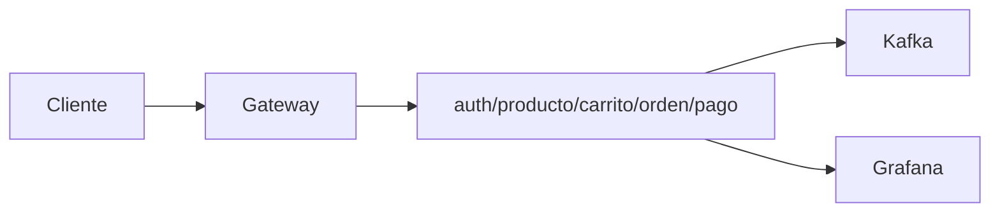

# S13 — Validación end-to-end del producto

> Esta sesión prueba SmartCampus como producto completo: login, catálogo, carrito, orden, pago, eventos y observabilidad.

---

## 1. Introducción
> Tiempo estimado: 20 min

### 1.1 Propósito
Diseñar y ejecutar pruebas end-to-end reproducibles.

### 1.2 Resultado de aprendizaje
El estudiante valida un flujo de negocio real atravesando varios microservicios.

### 1.3 Producto de sesión
Checklist E2E con comandos, respuestas esperadas y evidencias.

### 1.4 Motivación de la sesión
El usuario no evalúa servicios aislados: evalúa si puede comprar o publicar en el marketplace sin interrupciones.

### 1.5 Ubicación en el curso
- Unidad: U3 — Validación y consolidación.
- Producto de unidad: producto probado integralmente.
- Avance del producto en esta sesión: pruebas de flujo completo.

---

## 2. Explica
> Tiempo estimado: 15 min

### 2.1 Conceptos clave

| Concepto | Uso |
|---|---|
| E2E | Prueba flujo real |
| Precondición | Servicios y datos mínimos |
| Evidencia | Salida de comando o captura |
| Smoke test | Validación rápida |
| Regresión | Asegura que cambios no rompen |

### 2.2 Arquitectura del sistema en esta sesión

#### 2.2.1 Entorno DEV (Maven local)


#### 2.2.2 Entorno PROD local (Docker Compose)



### 2.3 Observabilidad y diagnóstico
Cada prueba E2E debe registrar: request, response, logs relevantes y estado de health.

---

## 3. Aplica — Actividad práctica guiada

### 3.1 Smoke test de infraestructura

```bash
curl http://localhost:28082/actuator/health
curl http://localhost:28761
curl http://localhost:8080/realms/smartcampus/.well-known/openid-configuration
```

```powershell
curl http://localhost:28082/actuator/health
curl http://localhost:28761
curl http://localhost:8080/realms/smartcampus/.well-known/openid-configuration
```

### 3.2 Prueba de negocio

```bash
curl -H "Authorization: Bearer <jwt>" http://localhost:28082/api/v1/productos
curl -H "Authorization: Bearer <jwt>" http://localhost:28082/api/v1/carritos
```

```powershell
curl -Headers @{ "Authorization"="Bearer <jwt>" } http://localhost:28082/api/v1/productos
curl -Headers @{ "Authorization"="Bearer <jwt>" } http://localhost:28082/api/v1/carritos
```

### 3.3 Tabla de archivos trabajados

| Archivo | Uso |
|---|---|
| `docs/rubrica-evaluacion.md` | Criterios |
| `README.md` | Arranque |
| `Makefile` | Comandos |
| `infra/config/config-repo/gateway-prod.yml` | Rutas finales |

---

## 4. Crea — Actividad autónoma

Construye una tabla E2E con 10 casos de prueba, incluyendo al menos 2 casos de error.

---

## 5. Cierre evaluativo

### Checklist
- [ ] Existe token válido.
- [ ] Producto responde.
- [ ] Carrito responde.
- [ ] Orden responde.
- [ ] Pago responde.
- [ ] Se verifican logs/metrics.

### Pregunta de defensa
¿Cómo demostrarías que el sistema funciona de extremo a extremo y no solo por servicios aislados?
