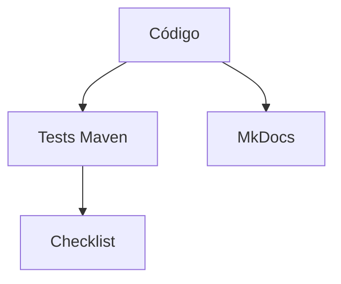
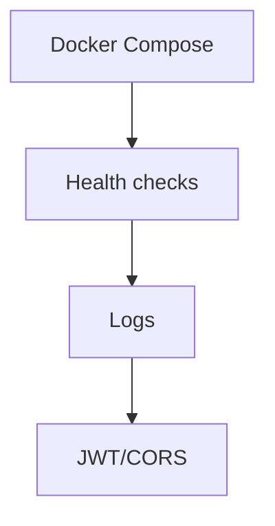

# S14 — Revisión técnica y estabilización del producto

> Esta sesión reduce riesgos antes de la defensa: limpieza, consistencia documental, pruebas, seguridad y despliegue.

---

## 1. Introducción
> Tiempo estimado: 20 min

### 1.1 Propósito
Estabilizar SmartCampus antes de la entrega final.

### 1.2 Resultado de aprendizaje
El estudiante identifica riesgos técnicos y aplica correcciones controladas.

### 1.3 Producto de sesión
Checklist de estabilización con riesgos, acciones y resultados.

### 1.4 Motivación de la sesión
Un producto distribuido puede compilar pero fallar por rutas incompletas, variables faltantes, secretos expuestos o servicios sin seguridad.

### 1.5 Ubicación en el curso
- Unidad: U3 — Validación y consolidación.
- Producto de unidad: producto estable y defendible.
- Avance del producto en esta sesión: hardening técnico.

---

## 2. Explica
> Tiempo estimado: 15 min

### 2.1 Conceptos clave

| Concepto | Uso |
|---|---|
| Hardening | Reducir superficie de riesgo |
| Deuda técnica | Pendientes conocidos |
| Smoke test | Validación rápida |
| CI | Verificación automática |
| Rollback | Estrategia de recuperación |

### 2.2 Arquitectura del sistema en esta sesión

#### 2.2.1 Entorno DEV (Maven local)



#### 2.2.2 Entorno PROD local (Docker Compose)



### 2.3 Observabilidad y diagnóstico
Revisar health checks, logs de arranque, rutas Gateway, endpoints públicos y privados.

---

## 3. Aplica — Actividad práctica guiada

### 3.1 Validar compilación de módulos críticos

```bash
mvn -f infra/gateway/pom.xml -DskipTests compile
mvn -f servicio/auth-ms/pom.xml -DskipTests compile
mvn -f servicio/producto-ms/pom.xml -DskipTests compile
```

```powershell
mvn -f infra/gateway/pom.xml -DskipTests compile
mvn -f servicio/auth-ms/pom.xml -DskipTests compile
mvn -f servicio/producto-ms/pom.xml -DskipTests compile
```

### 3.2 Validar documentación

```bash
mkdocs build --strict
```

```powershell
mkdocs build --strict
```

### 3.3 Tabla de archivos trabajados

| Archivo | Revisión |
|---|---|
| `.gitignore` | Secretos y artefactos ignorados |
| `infra/config/config-repo/*-prod.yml` | Variables PROD |
| `servicio/*/SecurityConfig.java` | Rutas protegidas |
| `.github/workflows/docs.yml` | Publicación docs |
| `docs/rubrica-evaluacion.md` | Evidencias |

---

## 4. Crea — Actividad autónoma

Lista 5 riesgos del proyecto y clasifícalos como alto, medio o bajo.

---

## 5. Cierre evaluativo

### Checklist
- [ ] No hay secretos reales.
- [ ] Los módulos críticos compilan.
- [ ] MkDocs construye.
- [ ] Rutas protegidas revisadas.
- [ ] Riesgos documentados.

### Pregunta de defensa
¿Qué priorizarías si solo tienes una hora para estabilizar el producto antes de presentarlo?
