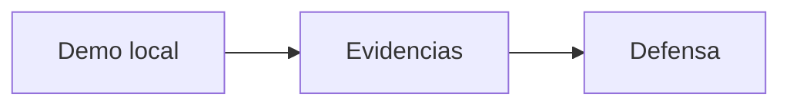
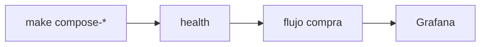

# S15 — Defensa técnica del producto

> Esta sesión prepara la exposición. El objetivo es explicar decisiones técnicas, evidencias y límites del sistema sin depender de improvisación.

---

## 1. Introducción
> Tiempo estimado: 20 min

### 1.1 Propósito
Preparar la defensa técnica de SmartCampus Marketplace.

### 1.2 Resultado de aprendizaje
El estudiante comunica arquitectura, flujos, seguridad, eventos y observabilidad con evidencias.

### 1.3 Producto de sesión
Guion de defensa, matriz de evidencias y demostración controlada.

### 1.4 Motivación de la sesión
El producto debe ser defendido técnicamente: no basta con mostrar pantallas, hay que explicar por qué la arquitectura funciona.

### 1.5 Ubicación en el curso
- Unidad: U3 — Validación y consolidación.
- Producto de unidad: defensa grupal coherente.
- Avance del producto en esta sesión: discurso técnico preparado.

---

## 2. Explica
> Tiempo estimado: 15 min

### 2.1 Conceptos clave

| Tema | Qué explicar |
|---|---|
| Arquitectura | Gateway, Eureka, Config, servicios |
| Seguridad | Keycloak, JWT, roles |
| Resiliencia | Feign y manejo de fallos |
| Kafka | Eventos y desacoplamiento |
| Observabilidad | Métricas y logs |
| Despliegue | Docker Compose |

### 2.2 Arquitectura del sistema en esta sesión

#### 2.2.1 Entorno DEV (Maven local)



#### 2.2.2 Entorno PROD local (Docker Compose)



### 2.3 Observabilidad y diagnóstico
Durante la defensa, tener abiertas pestañas de Gateway health, Eureka, Kafka UI y Grafana.

---

## 3. Aplica — Actividad práctica guiada

### 3.1 Guion mínimo

```text
1. Problema: marketplace universitario.
2. Arquitectura: microservicios + Gateway + Eureka + Config.
3. Seguridad: Keycloak y JWT.
4. Flujo de compra: producto -> carrito -> orden -> pago.
5. Kafka: evento orden/pago.
6. Observabilidad: health, métricas y logs.
7. Despliegue: Docker Compose.
```

### 3.2 Comandos de demo

```bash
make compose-all
curl http://localhost:28082/actuator/health
curl http://localhost:28761
```

```powershell
make compose-all
curl http://localhost:28082/actuator/health
curl http://localhost:28761
```

### 3.3 Tabla de archivos trabajados

| Archivo | Uso en defensa |
|---|---|
| `docs/arquitectura.md` | Diagrama general |
| `docs/seguridad.md` | JWT y roles |
| `docs/kafka-eventos.md` | Eventos |
| `docs/observabilidad.md` | Diagnóstico |
| `docs/produccion.md` | Despliegue |

---

## 4. Crea — Actividad autónoma

Prepara 5 preguntas difíciles que el docente podría hacer y redacta respuestas técnicas cortas.

---

## 5. Cierre evaluativo

### Checklist
- [ ] Hay guion.
- [ ] Hay evidencias.
- [ ] La demo tiene orden.
- [ ] Cada integrante conoce su aporte.
- [ ] Se reconocen limitaciones reales.

### Pregunta de defensa
¿Cuál fue la decisión técnica más importante del proyecto y qué alternativa descartaron?
