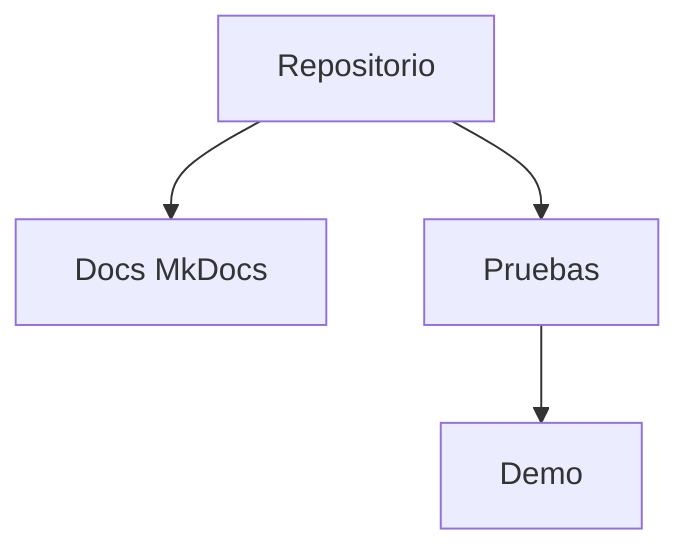
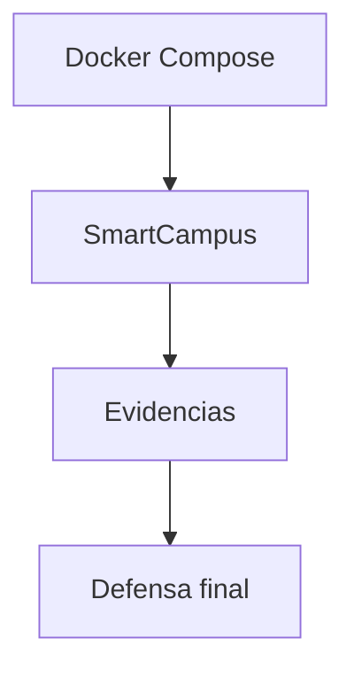

# S16 — Evaluación final y entrega del producto

> Esta sesión cierra el curso con la entrega final de SmartCampus Marketplace: sistema, documentación, evidencias y defensa.

---

## 1. Introducción
> Tiempo estimado: 20 min

### 1.1 Propósito
Presentar el producto final con documentación reproducible y evidencias verificables.

### 1.2 Resultado de aprendizaje
El estudiante defiende un sistema distribuido completo y reconoce sus límites técnicos.

### 1.3 Producto de sesión
Entrega final: repositorio, documentación publicada, demo y rúbrica completa.

### 1.4 Motivación de la sesión
La evaluación final mide el producto completo: funcionalidad, arquitectura, seguridad, despliegue, observabilidad y claridad técnica.

### 1.5 Ubicación en el curso
- Unidad: U3 — Validación y consolidación.
- Producto de unidad: producto final defendido.
- Avance del producto en esta sesión: cierre formal.

---

## 2. Explica
> Tiempo estimado: 15 min

### 2.1 Conceptos clave

| Entregable | Evidencia |
|---|---|
| Código | Repositorio GitHub |
| Documentación | GitHub Pages |
| Despliegue | Docker Compose |
| Seguridad | Keycloak/JWT |
| Eventos | Kafka UI/logs |
| Observabilidad | Grafana |
| Defensa | Guion y respuestas |

### 2.2 Arquitectura del sistema en esta sesión

#### 2.2.1 Entorno DEV (Maven local)



#### 2.2.2 Entorno PROD local (Docker Compose)



### 2.3 Observabilidad y diagnóstico
Antes de presentar, validar health, logs y métricas. Tener un plan si un servicio no levanta.

---

## 3. Aplica — Actividad práctica guiada

### 3.1 Build de documentación

```bash
mkdocs build --strict
```

```powershell
mkdocs build --strict
```

### 3.2 Estado Git

```bash
git status --short
```

```powershell
git status --short
```

### 3.3 Validación Compose

```bash
docker compose -f infra/compose.yml config --quiet
docker compose -f kafka/compose.yml config --quiet
docker compose -f obs/compose.yml config --quiet
```

```powershell
docker compose -f infra/compose.yml config --quiet
docker compose -f kafka/compose.yml config --quiet
docker compose -f obs/compose.yml config --quiet
```

### 3.4 Tabla de archivos trabajados

| Archivo | Uso |
|---|---|
| `mkdocs.yml` | Navegación final |
| `.github/workflows/docs.yml` | Publicación |
| `docs/index.md` | Portada |
| `docs/rubrica-evaluacion.md` | Criterios |
| `README.md` | Entrada del repositorio |

---

## 4. Crea — Actividad autónoma

Redacta una retrospectiva: qué se logró, qué falta y qué mejorarías si el proyecto continuara.

---

## 5. Cierre evaluativo

### Checklist
- [ ] Repositorio limpio.
- [ ] Docs construyen.
- [ ] Demo funciona.
- [ ] Rúbrica cubierta.
- [ ] Defensa preparada.

### Pregunta de defensa
¿Qué evidencia demuestra mejor que SmartCampus es un sistema distribuido y no solo varios proyectos separados?
