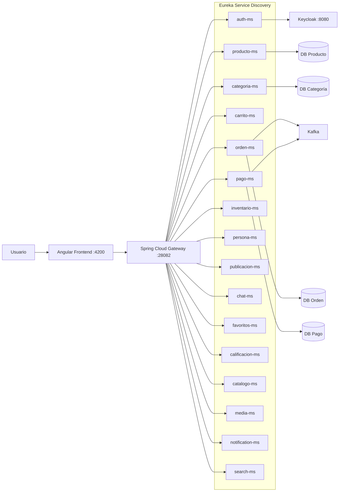

# SmartCampus Marketplace — Estructura y Arquitectura Actual

Fecha del análisis: 2026-06-26  
Propósito: Documentar la estructura real del repositorio, la arquitectura, el flujo frontend-backend y los vacíos detectados.

---

## 1. Descripción general

SmartCampus Marketplace es una plataforma de mercado digital universitario basada en microservicios. Permite publicar, buscar, comprar y gestionar productos o servicios dentro de un entorno académico.

**Stack tecnológico:**

| Componente | Tecnología |
|------------|-----------|
| Frontend | Angular 20 (standalone components, TypeScript, RxJS) |
| Backend | Java 17, Spring Boot 3.2.x |
| API Gateway | Spring Cloud Gateway (WebFlux) |
| Service Discovery | Netflix Eureka |
| Configuración | Spring Cloud Config Server (native) |
| Base de datos | PostgreSQL por microservicio |
| Migraciones | Flyway |
| Identidad | Keycloak 25.x (realm \smartcampus\) |
| Mensajería | Apache Kafka (KRaft mode) |
| Observabilidad | Prometheus, Loki, Promtail, Grafana |
| Contenedores | Docker Compose |

---

## 2. Estado de \estructura_proyecto.txt\

El archivo \estructura_proyecto.txt\ en la raíz del repositorio está **desactualizado** respecto a la estructura real del proyecto. A continuación se detallan las diferencias:

| Elemento | \estructura_proyecto.txt\ | Realidad actual detectada | Estado |
|----------|--------------------------|--------------------------|--------|
| \.agents/\ | 3 archivos listados | 4 archivos (falta \migrate-figma-react-to-angular-report.md\) | Desactualizado |
| \rontend/app/\ | 30 archivos listados | 74 archivos, 14 directorios | **Significativamente desactualizado** |
| \servicio/\ | 16 servicios listados | 16 servicios presentes | Coincide |
| \infra/\ | Directorios básicos sin detalle | \compose.yml\, \.env\, \.env.example\, config-repo completo (38 archivos YAML) | Más detalle real |
| \keycloak/\ | Solo mencionado | \compose.yml\ + \
ealm-smartcampus.json\ | Coincide |
| \kafka/\ | Solo mencionado | \compose.yml\ + \compose-dev.yml\ + \README.md\ | Coincide parcialmente |
| \obs/\ | Solo mencionado | \compose.yml\ + \compose-dev.yml\ + configs de Grafana/Loki/Prometheus/Promtail | Coincide parcialmente |

**Conclusión:** \estructura_proyecto.txt\ debe mantenerse como referencia histórica, pero \estructura_proyecto.md\ es ahora el documento oficial actualizado.

---

## 3. Estructura general del proyecto

\\\
SmartCampus-Marketplace/
├── .agents/                          # Reportes de diagnóstico de agentes IA
│   ├── fix-auth-ms-keycloak-gateway-report.md
│   ├── frontend-gateway-auth-report.md
│   ├── migrate-figma-react-to-angular-report.md
│   └── test-auth-ms-report.md
├── .github/
│   └── workflows/
│       └── docker-build.yml          # CI/CD: build de imágenes Docker
├── frontend/                         # Aplicación Angular 20
│   ├── angular.json
│   ├── package.json
│   ├── tsconfig.json / tsconfig.app.json / tsconfig.spec.json
│   ├── public/
│   └── src/
│       ├── index.html
│       ├── main.ts
│       ├── styles.css
│       └── app/
│           ├── app.component.ts / app.html / app.css
│           ├── app.config.ts
│           ├── app.routes.ts
│           ├── app.ts (bootstrap)
│           ├── core/
│           │   ├── config/api.config.ts
│           │   ├── interceptors/auth-token.interceptor.ts
│           │   ├── models/ (auth, chat, listing, product, user)
│           │   ├── services/ (auth-api, chat, gateway, marketplace, session)
│           │   └── utils/http-error.util.ts
│           ├── guards/ (auth.guard.ts, guest.guard.ts)
│           ├── pages/ (chat/, home/, listing-detail/, login/, profile/, publish/, register/)
│           └── shared/
│               ├── components/ (category-chip, empty-state, listing-card, loading, navbar, search-bar)
│               └── layout/main-layout/
├── infra/                            # Infraestructura base
│   ├── compose.yml                   # Orquestación: config + eureka + gateway
│   ├── .env / .env.example           # Variables de entorno (JWT_SECRET)
│   ├── README.md
│   ├── config/                       # Spring Cloud Config Server
│   │   ├── Dockerfile
│   │   ├── pom.xml
│   │   ├── config-repo/             # 38 archivos YAML de configuración centralizada
│   │   └── src/
│   ├── eureka/                       # Netflix Eureka Server
│   │   ├── Dockerfile
│   │   ├── pom.xml
│   │   └── src/
│   └── gateway/                      # Spring Cloud Gateway
│       ├── Dockerfile
│       ├── pom.xml
│       ├── README.md
│       └── src/
│           ├── main/java/com/upeu/gateway/
│           │   ├── GatewayApplication.java
│           │   ├── config/ (SecurityConfig, JwtProperties, CorsGlobalConfig)
│           │   └── filter/TraceIdGlobalFilter.java
│           └── test/
├── keycloak/                         # Proveedor de identidad OAuth2
│   ├── compose.yml
│   └── realm-smartcampus.json        # Realm importable con client marketplace-client
├── kafka/                            # Mensajería asíncrona
│   ├── compose.yml                   # Producción (network: ecom-prod-net)
│   ├── compose-dev.yml               # Desarrollo (network: ecom-dev-net)
│   └── README.md
├── obs/                              # Observabilidad
│   ├── compose.yml / compose-dev.yml
│   ├── README.md
│   ├── grafana/provisioning/datasources/
│   ├── loki/config.yml
│   ├── prometheus/prometheus.yml
│   └── promtail/config.yml
├── servicio/                         # Microservicios de dominio (16)
│   ├── auth-ms/
│   ├── calificacion-ms/
│   ├── carrito-ms/
│   ├── catalogo-ms/
│   ├── categoria-ms/
│   ├── chat-ms/
│   ├── favoritos-ms/
│   ├── inventario-ms/
│   ├── media-ms/
│   ├── notification-ms/
│   ├── orden-ms/
│   ├── pago-ms/
│   ├── persona-ms/
│   ├── producto-ms/
│   ├── publicacion-ms/
│   └── search-ms/
├── AGENTS.md                         # Guía principal para agentes de IA
├── GUIA_ESTUDIANTE.md                # Guía para estudiantes
├── README.md                         # Documentación principal del repositorio
└── estructura_proyecto.txt           # Versión anterior (referencia histórica)
\\\

### Rol de cada carpeta principal

| Carpeta | Rol |
|---------|-----|
| \.agents/\ | Reportes de diagnóstico generados por agentes de IA durante sesiones anteriores |
| \rontend/\ | Aplicación Angular 20 standalone. Consume el backend exclusivamente a través del Gateway |
| \infra/\ | Infraestructura base: Config Server, Eureka, Gateway, compose principal y configuración centralizada |
| \servicio/\ | Microservicios Spring Boot. Cada uno tiene su propio \pom.xml\, \Dockerfile\, \compose.yml\ y migraciones Flyway |
| \keycloak/\ | Proveedor OAuth2. Realm \smartcampus\ con cliente público \marketplace-client\ |
| \kafka/\ | Kafka en modo KRaft (sin ZooKeeper) + Kafka UI + Kafka Exporter |
| \obs/\ | Stack de observabilidad: Prometheus (métricas), Loki + Promtail (logs), Grafana (dashboards) |
---

## 4. Arquitectura actual

El sistema sigue una arquitectura de microservicios con las siguientes capas:

1. **Frontend Angular** — Aplicación SPA que se comunica únicamente con el Gateway.
2. **Spring Cloud Gateway** — Punto único de entrada. Enruta peticiones usando `lb://SERVICE` (resuelto por Eureka).
3. **Eureka** — Registro y descubrimiento de servicios.
4. **Config Server** — Configuración centralizada desde `infra/config/config-repo/`.
5. **Microservicios** — 16 servicios de dominio registrados en Eureka.
6. **Keycloak** — Autoridad de identidad OAuth2.
7. **Kafka** — Mensajería asíncrona entre servicios (orden-ms, pago-ms).
8. **PostgreSQL** — Base de datos por microservicio, migraciones con Flyway.



**Flujo de solicitud típico:**

```
Angular → Gateway (ruta por Path) → lb://SERVICE (Eureka resuelve IP:puerto) → Microservicio → DB/Keycloak/Kafka
```

---

## 5. Flujo frontend-backend

### 5.1 Mecanismo general

1. El usuario interactúa con la SPA Angular.
2. Angular construye URLs absolutas apuntando al Gateway (detección automática vía `GatewayService`).
3. El `GatewayService` sondea `/actuator/health` de los candidatos PROD (28082) y DEV (18080) en orden de prioridad.
4. Cada petición autenticada incluye `Authorization: Bearer <token>` gracias al `AuthTokenInterceptor`.
5. El Gateway evalúa las rutas configuradas y redirige al servicio destino usando `lb://NOMBRE-SERVICIO`.
6. Eureka resuelve la instancia activa del servicio.
7. Cada microservicio procesa la solicitud contra su propia base de datos PostgreSQL.
8. Para flujos cross-servicio, se usa OpenFeign (síncrono) entre microservicios.
9. Para eventos asíncronos (órdenes, pagos), se usa Kafka.

### 5.2 Flujos específicos

#### Login

```
Angular → POST /auth/login → Gateway → lb://AUTH-MS → auth-ms → Keycloak (password grant) → JWT → Angular
```

**Estado: ✅ Funcional** — Probado end-to-end con `devuser` / `123456`.

#### Register

```
Angular → POST /auth/register → Gateway → lb://AUTH-MS → auth-ms → ???
```

**Estado: ⚠️ Corregido recientemente / validar en ejecución.** El frontend llama a este endpoint, pero en análisis previo auth-ms solo exponía `/auth/login`. Verificar si se agregó recientemente.

#### /auth/me

```
Angular → GET /auth/me → Gateway → lb://AUTH-MS → auth-ms → ???
```

**Estado: ⚠️ Corregido recientemente / validar en ejecución.** Similar a register. Verificar si auth-ms implementa este endpoint ahora.

#### Listado de productos

```
Angular → GET /api/v1/productos → Gateway → lb://PRODUCTO-MS → producto-ms → PostgreSQL
```

#### Categorías

```
Angular → GET /api/v1/categorias → Gateway → lb://CATEGORIA-MS → categoria-ms → PostgreSQL
```

#### Publicar producto

```
Angular → POST /api/v1/productos → Gateway → lb://PRODUCTO-MS → producto-ms → PostgreSQL
```

#### Checkout (orden + pago)

```
Angular → POST /api/v1/ordenes → Gateway → lb://ORDEN-MS → orden-ms → PostgreSQL + Kafka
       → POST /api/v1/pagos → Gateway → lb://PAGO-MS → pago-ms → PostgreSQL + Kafka
```
---

## 6. Frontend Angular

### 6.1 Caracteristicas tecnicas

| Caracteristica | Detalle |
|---------------|---------|
| Version Angular | 20 |
| Componentes | Standalone (sin NgModules) |
| Forms | Reactive Forms |
| HTTP | `HttpClient` con `withInterceptors` |
| Routing | `provideRouter` con guards funcionales |
| Estilos | CSS plano por componente |

### 6.2 Rutas actuales

| Ruta | Componente | Guard | Estado | Observacion |
|------|-----------|-------|--------|-------------|
| `/` | `HomePageComponent` | Ninguno | Activo | Pagina principal |
| `/login` | `LoginPageComponent` | `guestGuard` | Activo | Flat component `login-page.component.*` |
| `/register` | `RegisterComponent` | `guestGuard` | Activo | Subdirectorio `pages/register/` |
| `/publish` | `PublishPageComponent` | `authGuard` | Activo | Flat component `publish-page.component.*` |
| `/listing/:id` | `ListingDetailPageComponent` | Ninguno | Activo | Flat component `listing-detail-page.component.*` |
| `/profile` | `ProfileComponent` | `authGuard` | Activo | Subdirectorio `pages/profile/` (usa datos mock) |
| `/chat` | `ChatComponent` | `authGuard` | Activo | Subdirectorio `pages/chat/` (usa datos mock/localStorage) |
| `/publicar` | Redirect -> `/publish` | -- | Alias | Redireccion |
| `/publicacion/:id` | Redirect -> `/listing/:id` | -- | Alias | Redireccion |
| `/registro` | Redirect -> `/register` | -- | Alias | Redireccion |
| `**` | Redirect -> `/` | -- | Catch-all | Redireccion a home |

### 6.3 Dualidad de convenciones (migracion en progreso)

El frontend tiene **dos formas de organizar paginas** que coexisten:

| Convencion | Ejemplos | Estado |
|-----------|----------|--------|
| **Flat** (`*-page.component.*`) | `home-page`, `login-page`, `listing-detail-page`, `publish-page`, `register-page` | Legacy -- 5 componentes |
| **Subdirectorio** (`pages/<name>/`) | `pages/register/`, `pages/profile/`, `pages/chat/` | Nueva -- 3 componentes |

**Problema:** Esta dualidad duplica logica y crea confusion. Las rutas activas usan los componentes flat para `home`, `login`, `listing-detail`, `publish` y el componente de subdirectorio para `register`. Los componentes de subdirectorio `profile` y `chat` no tienen equivalente flat.

**Recomendacion:** Migrar los 5 componentes flat restantes a subdirectorios y eliminar los archivos legacy, validando que ninguna ruta los referencie.

### 6.4 Servicios principales

| Servicio | Archivo | Proposito |
|----------|---------|-----------|
| `GatewayService` | `core/services/gateway.service.ts` | Detecta Gateway activo (PROD/DEV) via health endpoint, expone `baseUrl()` |
| `AuthApiService` | `core/services/auth-api.service.ts` | Login, register, me hacia `/auth/*` |
| `MarketplaceService` | `core/services/marketplace.service.ts` | CRUD de productos, categorias, ordenes, pagos |
| `SessionService` | `core/services/session.service.ts` | Persistencia de sesion en `localStorage`, getToken(), userId/username signals |
| `ChatService` | `core/services/chat.service.ts` | Conversaciones y mensajes (actualmente con datos mock) |

### 6.5 Interceptor y Guards

| Archivo | Proposito |
|---------|-----------|
| `auth-token.interceptor.ts` | Interceptor HTTP que anade `Authorization: Bearer <token>` a cada peticion |
| `auth.guard.ts` | Protege rutas que requieren autenticacion (redirige a `/login`) |
| `guest.guard.ts` | Protege rutas de invitados (redirige a `/` si ya autenticado) |

### 6.6 Modelos

| Modelo | Proposito |
|--------|-----------|
| `auth.model.ts` | `LoginRequest`, `LoginResponse`, `RegisterRequest` |
| `listing.model.ts` | `MarketplaceListing` (interfaz unificada para listados) |
| `product.model.ts` | `ProductResponse`, `ProductRequest`, `CategoriaDto`, `CheckoutRequest`, `PurchaseSummary` |
| `chat.model.ts` | `ChatUser`, `ChatMessage`, `ChatConversation` |
| `user.model.ts` | `User` (perfil de usuario) |
---

## 7. Conexion frontend-backend

| Pantalla Angular | Servicio Angular | Endpoint llamado | Gateway Route ID | Microservicio destino | Estado | Observacion |
|-----------------|-----------------|-----------------|-----------------|----------------------|--------|-------------|
| Login | `AuthApiService` | `POST /auth/login` | `auth-route` | `AUTH-MS` | Funcional | Probado end-to-end |
| Register | `AuthApiService` | `POST /auth/register` | `auth-route` | `AUTH-MS` | Corregido recientemente / validar en ejecucion | En analisis previo auth-ms solo exponia `/auth/login` |
| Perfil | `AuthApiService` | `GET /auth/me` | `auth-route` | `AUTH-MS` | Corregido recientemente / validar en ejecucion | Verificar si auth-ms implementa este endpoint |
| Home / Listados | `MarketplaceService` | `GET /api/v1/productos` | `producto-route` | `PRODUCTO-MS` | Ruta existe en Gateway | Pendiente verificar endpoint real en producto-ms |
| Detalle producto | `MarketplaceService` | `GET /api/v1/productos/detalle/{id}` | `producto-route` | `PRODUCTO-MS` | Pendiente de verificar en ejecucion | Ruta existe en Gateway; verificar endpoint en producto-ms |
| Categorias | `MarketplaceService` | `GET /api/v1/categorias` | `categoria-route` | `CATEGORIA-MS` | Ruta existe en Gateway | -- |
| Publicar | `MarketplaceService` | `POST /api/v1/productos` | `producto-route` | `PRODUCTO-MS` | Ruta existe en Gateway | -- |
| Checkout (orden) | `MarketplaceService` | `POST /api/v1/ordenes` | `orden-route` | `ORDEN-MS` | Ruta existe en Gateway | -- |
| Checkout (pago) | `MarketplaceService` | `POST /api/v1/pagos` | `pago-route` | `PAGO-MS` | Ruta existe en Gateway | -- |
| Chat | `ChatService` | -- | `chat-route` | `CHAT-MS` | Pendiente de integracion real | Actualmente usa datos mock/localStorage |
---

## 8. Microservicios

### 8.1 Tabla de servicios

| Servicio | Responsabilidad | Nivel | Tests unitarios | Feign Client | Kafka | Exception Handler | Correlation Filter | OpenAPI Config |
|----------|----------------|-------|:---------------:|:------------:|:-----:|:-----------------:|:-----------------:|:--------------:|
| `auth-ms` | Autenticacion y autorizacion, proxy hacia Keycloak | Basico | 1 test | No | No | No | No | No |
| `calificacion-ms` | Calificaciones y resenas de productos/usuarios | Basico | No | No | No | No | No | No |
| `carrito-ms` | Carrito de compras | Rico | No | Si | No | Si | Si | Si |
| `catalogo-ms` | Catalogo (categorias extendidas, busqueda interna) | Rico | 4 tests | No | No | Si | Si | Si |
| `categoria-ms` | CRUD de categorias | Basico | No | No | No | No | No | No |
| `chat-ms` | Mensajeria entre usuarios | Basico | No | No | No | No | No | No |
| `favoritos-ms` | Productos favoritos por usuario | Basico | No | No | No | No | No | No |
| `inventario-ms` | Control de stock e inventario | Rico | No | Si | No | Si | Si | Si |
| `media-ms` | Gestion de imagenes y archivos multimedia | Basico | No | No | No | No | No | No |
| `notification-ms` | Notificaciones (in-app / email) | Basico | No | No | No | No | No | No |
| `orden-ms` | Ordenes de compra | **Completo** | No | Si | Si | Si | Si | Si |
| `pago-ms` | Procesamiento de pagos | **Completo** | No | Si | Si | Si | Si | Si |
| `persona-ms` | Datos personales de usuarios | Basico | No | No | No | No | No | No |
| `producto-ms` | CRUD de productos | Rico | 4 tests | Si | No | Si | Si | Si |
| `publicacion-ms` | Publicaciones y visibilidad de productos | Basico | No | No | No | No | No | No |
| `search-ms` | Busqueda y filtrado de productos | Basico | No | No | No | No | No | No |

### 8.2 Clasificacion

| Nivel | Criterio | Servicios |
|-------|----------|-----------|
| **Completo** | Feign + Kafka + Exception + Filter + OpenAPI | `orden-ms`, `pago-ms` |
| **Rico** | Feign + Exception + Filter + OpenAPI | `carrito-ms`, `catalogo-ms`, `inventario-ms`, `producto-ms` |
| **Basico** | Sin extras arquitectonicos | `auth-ms`, `calificacion-ms`, `categoria-ms`, `chat-ms`, `favoritos-ms`, `media-ms`, `notification-ms`, `persona-ms`, `publicacion-ms`, `search-ms` |

### 8.3 Patron de capas

Los servicios siguen este patron general (con excepciones):

```
controller/ -> service/ (o service/impl/) -> repository/ -> entity/
                                          -> dto/
                                          -> mapper/  (en servicios ricos)
                                          -> config/
                                          -> exception/  (en servicios ricos)
                                          -> client/ (Feign, en servicios con integracion)
                                          -> filter/ (correlation ID, en servicios ricos)
                                          -> evento/ (Kafka, solo orden-ms y pago-ms)
```

**Excepciones:** `auth-ms` y `persona-ms` no usan subpaquete `service/impl/`; colocan la implementacion directamente en `service/`.

### 8.4 Vacios detectados en backend

| Vacio | Servicios afectados | Severidad |
|-------|-------------------|-----------|
| Sin tests unitarios | 13 de 16 servicios | Alta |
| Sin Exception Handler global | auth-ms, calificacion-ms, categoria-ms, chat-ms, favoritos-ms, media-ms, notification-ms, persona-ms, publicacion-ms, search-ms | Media |
| Sin Correlation ID filter | Mismos 10 servicios basicos | Media |
| Sin OpenAPI / Swagger | Mismos 10 servicios basicos | Media |
| Sin Feign (comunicacion interna) | 10 servicios basicos | Baja (depende de necesidades) |
| Sin Kafka events | 14 servicios (solo orden-ms y pago-ms lo usan) | Baja |
---

## 9. Gateway

### 9.1 Diferencias entre profiles

| Caracteristica | `gateway-dev.yml` | `gateway-prod.yml` |
|---------------|-------------------|-------------------|
| Rutas CRUD + instancia | Todas (16 servicios) | Todas (16 servicios) |
| Rutas Swagger | 15 rutas swagger (todos excepto auth) | **Ausentes** |
| `forwarded.enabled: false` | Si | Si |
| Eureka URL | `http://localhost:18761/eureka` | `http://eureka:8761/eureka` |
| Keycloak issuer-uri | `${KEYCLOAK_URL:http://localhost:8080}/realms/smartcampus` | `${KEYCLOAK_URL:http://keycloak:8080}/realms/smartcampus` |
| Eureka hostname | `localhost` | (por defecto Docker) |
| Management endpoints | health, info, metrics, prometheus, circuitbreakers, circuitbreakerevents | health, info, metrics, prometheus |

### 9.2 Rutas del Gateway

| Ruta | Microservicio destino | DEV | PROD | Estado |
|------|----------------------|:---:|:----:|--------|
| `/auth/**` | `AUTH-MS` | Si | Si | Probado |
| `/api/v1/catalogo/instancia` | `CATALOGO-MS` | Si | Si | Pendiente verificar |
| `/api/v1/productos/**` | `PRODUCTO-MS` | Si | Si | Pendiente verificar |
| `/api/v1/producto/instancia` | `PRODUCTO-MS` | Si | Si | Pendiente verificar |
| `/api/v1/ordenes/**` | `ORDEN-MS` | Si | Si | Pendiente verificar |
| `/api/v1/pagos/**` | `PAGO-MS` | Si | Si | Pendiente verificar |
| `/api/v1/carritos/**` | `CARRITO-MS` | Si | Si | Pendiente verificar |
| `/api/v1/inventarios/**` | `INVENTARIO-MS` | Si | Si | Pendiente verificar |
| `/api/v1/calificaciones/**` | `CALIFICACION-MS` | Si | Si | Pendiente verificar |
| `/api/v1/categorias/**` | `CATEGORIA-MS` | Si | Si | Pendiente verificar |
| `/api/v1/chats/**` | `CHAT-MS` | Si | Si | Pendiente verificar |
| `/api/v1/favoritos/**` | `FAVORITOS-MS` | Si | Si | Pendiente verificar |
| `/api/v1/media/**` | `MEDIA-MS` | Si | Si | Pendiente verificar |
| `/api/v1/notificaciones/**` | `NOTIFICATION-MS` | Si | Si | Pendiente verificar |
| `/api/v1/personas/**` | `PERSONA-MS` | Si | Si | Pendiente verificar |
| `/api/v1/publicaciones/**` | `PUBLICACION-MS` | Si | Si | Pendiente verificar |
| `/api/v1/search/**` | `SEARCH-MS` | Si | Si | Pendiente verificar |
| `/<service>/swagger-ui/**` | Swagger UI (cada MS) | Si -- 15 rutas | No | Solo DEV |
| `/<service>/v3/api-docs/**` | OpenAPI docs (cada MS) | Si -- 15 rutas | No | Solo DEV |

### 9.3 Rutas publicas vs protegidas

En `SecurityConfig.java` del Gateway:

| Ruta | Acceso |
|------|--------|
| `/actuator/health`, `/actuator/info`, `/actuator/prometheus` | `permitAll()` |
| `/auth/**` | `permitAll()` |
| `/swagger-ui.html`, `/swagger-ui/**`, `/v3/api-docs/**`, `/*/swagger-ui/**`, `/*/v3/api-docs/**` | `permitAll()` |
| `/api/v1/categorias/**` | `permitAll()` |
| `GET /api/v1/productos/**` | `permitAll()` |
| `OPTIONS` (todos los metodos) | `permitAll()` |
| Todas las demas rutas | Requiere autenticacion JWT |

### 9.4 CORS

Configurado en `CorsGlobalConfig.java`:

- Origenes permitidos: `http://localhost:4200`, `http://localhost:4300`
- Metodos: todos
- Headers: todos
- Credentials: true
---

## 10. Autenticacion y seguridad

### 10.1 Flujo de autenticacion

```
1. Usuario ingresa credenciales en Angular (login-page)
2. AuthApiService.login() -> POST http://<gateway>/auth/login
3. Gateway enruta a lb://AUTH-MS
4. Auth-ms recibe { username, password }
5. Auth-ms hace password grant contra Keycloak:
   POST http://keycloak:8080/realms/smartcampus/protocol/openid-connect/token
   grant_type=password&client_id=marketplace-client&username=...&password=...
6. Keycloak valida credenciales y devuelve JWT (access_token, refresh_token)
7. Auth-ms devuelve JWT al frontend
8. SessionService guarda el token en localStorage (clave: smartcampus-session)
9. Cada peticion posterior incluye: Authorization: Bearer <token>
10. Gateway valida el JWT usando jwk-set-uri de Keycloak
11. Los roles se extraen de realm_access.roles
```

### 10.2 Componentes de seguridad

| Componente | Ubicacion | Proposito |
|-----------|-----------|-----------|
| `SecurityConfig.java` (Gateway) | `infra/gateway/src/.../config/` | Configura rutas publicas/protegidas, JWT validation |
| `JwtProperties.java` (Gateway) | `infra/gateway/src/.../config/` | Propiedades JWT (secret, issuer) |
| `SecurityConfig.java` (cada MS) | `servicio/*/src/.../config/` | OAuth2 Resource Server config por servicio |
| `JwtProperties.java` (auth-ms) | `servicio/auth-ms/src/.../config/` | Propiedades JWT para auth-ms |
| `AuthApiService` (Angular) | `frontend/src/app/core/services/` | Login/register/me |
| `SessionService` (Angular) | `frontend/src/app/core/services/` | Manejo de sesion en localStorage |
| `AuthTokenInterceptor` (Angular) | `frontend/src/app/core/interceptors/` | Adjunta Bearer token a peticiones |
| `AuthGuard` (Angular) | `frontend/src/app/guards/` | Protege rutas privadas |
| `GuestGuard` (Angular) | `frontend/src/app/guards/` | Protege rutas de invitados |

### 10.3 Realm de Keycloak

| Propiedad | Valor |
|-----------|-------|
| Realm | `smartcampus` |
| Cliente | `marketplace-client` |
| Tipo de cliente | Publico |
| Direct Access Grants | Habilitado (password grant) |
| Usuario por defecto | `devuser` / `123456` |
| Rol por defecto | `USER` |

### 10.4 Pendientes de seguridad

| Pendiente | Descripcion |
|-----------|-------------|
| Validar registro real | Probar register con Keycloak levantado. En analisis previo, auth-ms solo exponia `/auth/login` |
| Validar `/auth/me` | Probar con token real. Verificar si auth-ms implementa este endpoint |
| Logout con Keycloak | Actualmente logout solo limpia localStorage. Revisar si debe invalidar sesion en Keycloak |
| Roles y autorizacion fina | Verificar que rutas requieren roles especificos y si estan configuradas |
| Endpoints sensibles | Revisar endpoints de escritura/borrado/pagos para verificar proteccion por roles |
---

## 11. Docker e inicializacion

### 11.1 Puertos principales

| Componente | Puerto interno | Puerto host (produccion) | Puerto host (desarrollo) |
|-----------|:--------------:|:------------------------:|:------------------------:|
| Config Server | 8888 | 28888 | 18888 |
| Eureka | 8761 | 28761 | 18761 |
| Gateway | 8080 | 28082 | 18080 |
| Keycloak | 8080 | 8080 | 8080 |
| Kafka | 9092 | 29092 | 41092 (dev) |
| Kafka Exporter | 9308 | 29308 | -- |
| Kafka UI | 8080 | 28085 | -- |
| Prometheus | 9090 | 29090 | -- |
| Loki | 3100 | 23100 | -- |
| Grafana | 3000 | 23000 | -- |

### 11.2 Red Docker

Todos los servicios de produccion comparten la red externa `ecom-prod-net`.

```bash
docker network create ecom-prod-net
```

### 11.3 Como levantar el stack completo

```bash
# 1. Crear red compartida (solo primera vez)
docker network create ecom-prod-net

# 2. Levantar Keycloak
docker compose -f keycloak/compose.yml up -d

# 3. Levantar infraestructura base (Config Server, Eureka, Gateway)
docker compose -f infra/compose.yml up -d --build

# 4. Levantar Kafka (opcional, necesario para ordenes/pagos)
docker compose -f kafka/compose.yml up -d

# 5. Levantar observabilidad (opcional)
docker compose -f obs/compose.yml up -d

# 6. Levantar microservicios individuales
docker compose -f servicio/auth-ms/compose.yml up -d --build
docker compose -f servicio/producto-ms/compose.yml up -d --build
```

### 11.4 Desarrollo local (sin Docker para microservicios)

```bash
# 1. Levantar Keycloak
docker compose -f keycloak/compose.yml up -d

# 2. Levantar infraestructura base
docker compose -f infra/compose.yml up -d --build

# 3. Ejecutar auth-ms localmente (se registra en Eureka automaticamente)
mvn -f servicio/auth-ms/pom.xml spring-boot:run

# 4. Ejecutar frontend
cd frontend
npm install
npm start

# 5. Verificar health
curl http://localhost:18888/actuator/health   # Config Server
curl http://localhost:18761/eureka/apps       # Eureka
curl http://localhost:18080/actuator/health   # Gateway
```
---

## 12. Vacios detectados

### 12.1 Vacios backend

| Vacio | Detalle | Severidad |
|-------|---------|-----------|
| **13/16 servicios sin tests** | Solo `auth-ms`, `catalogo-ms` y `producto-ms` tienen tests unitarios | Alta |
| **Servicios basicos sin filtros/exceptions/OpenAPI** | 10 servicios no implementan correlation ID filters, exception handlers globales ni OpenAPI | Media |
| **Chat real pendiente** | `chat-ms` existe pero frontend usa datos mock; no hay integracion real verificada | Media |
| **Search real pendiente** | `search-ms` existe pero no se ha validado su integracion ni el frontend lo consume | Media |
| **Notificaciones reales pendientes** | `notification-ms` existe pero el frontend no lo consume | Media |
| **Media/imagenes pendientes** | `media-ms` existe pero el frontend usa URLs hardcodeadas de Unsplash | Media |
| **Favoritos/calificaciones pendientes de validar** | Servicios existen pero no se ha verificado integracion end-to-end | Baja |
| **Moderacion de contenido** | No se ha identificado un servicio de moderacion; pendiente de verificar si existe en algun servicio existente | Baja |
| **`auth-ms` y `persona-ms` sin service/impl** | Inconsistencia arquitectonica leve respecto a los otros 14 servicios | Baja |

### 12.2 Vacios frontend

| Vacio | Detalle | Severidad |
|-------|---------|-----------|
| **Componentes duplicados** | 5 paginas tienen convencion flat + versiones en subdirectorio; conviven archivos legacy y nuevos | Media |
| **Migracion incompleta de paginas** | Las rutas activas usan una mezcla de flat y subdirectorios | Media |
| **Perfil con datos mock** | `ProfileComponent` usa `getCurrentUser()` que retorna datos hardcodeados | Media |
| **Chat con localStorage/mock** | `ChatService` usa datos mock; no hay integracion real con `chat-ms` | Media |
| **Imagenes hardcodeadas (Unsplash)** | `marketplace.service.ts` lineas 188-194: URLs fijas de Unsplash sin integracion con `media-ms` | Media |
| **Sin pagina 404 personalizada** | El catch-all redirige a `/` en lugar de mostrar una pagina 404 | Baja |
| **Posibles botones/flujos pendientes** | Verificar si hay elementos de UI que referencian rutas o funcionalidades no implementadas | Baja |

### 12.3 Vacios de integracion

| Vacio | Detalle | Severidad |
|-------|---------|-----------|
| **Validar register real** | El frontend llama `POST /auth/register`; en analisis previo auth-ms no lo exponia. **Corregido recientemente / validar en ejecucion** | Alta |
| **Validar `/auth/me`** | El frontend llama `GET /auth/me`; verificar si auth-ms lo implementa ahora. **Corregido recientemente / validar en ejecucion** | Alta |
| **Validar perfil real** | Conectar perfil con `persona-ms` o extender `auth-ms` para datos de perfil | Media |
| **Validar chat real** | Conectar `ChatComponent` con `chat-ms` a traves del Gateway | Media |
| **Validar checkout completo** | Probar flujo orden -> pago con Kafka y PostgreSQL | Media |
| **Validar detalle de producto** | Endpoint `/api/v1/productos/detalle/{id}` existe en Gateway; verificar en `producto-ms` | Baja |

### 12.4 Vacios de seguridad

| Vacio | Detalle | Severidad |
|-------|---------|-----------|
| **Logout con Keycloak** | Actualmente logout solo limpia localStorage; no invalida sesion en Keycloak | Media |
| **Roles y autorizacion fina** | Roles (`USER`, `ADMIN`) estan en el JWT pero no se verifica su aplicacion en endpoints sensibles | Media |
| **Endpoints sensibles a revisar** | Verificar que endpoints de escritura/borrado/pagos requieran autenticacion y roles adecuados | Media |

### 12.5 Vacios de documentacion

| Vacio | Detalle | Severidad |
|-------|---------|-----------|
| **`estructura_proyecto.txt` desactualizado** | No refleja la estructura real; reemplazado por `estructura_proyecto.md` | Media |
| **Necesidad de mantener documentacion actualizada** | Cada cambio significativo debe reflejarse en `estructura_proyecto.md` | Media |
---

## 13. Recomendaciones futuras

### Prioridad alta (core functionality)

1. **Probar flujo register real** — Verificar si `auth-ms` ahora expone `POST /auth/register` y probar end-to-end.
2. **Probar login real** — Ya funcional desde analisis previo (`devuser`/`123456`).
3. **Validar `/auth/me`** — Verificar si `auth-ms` implementa `GET /auth/me` y que devuelva datos de usuario.
4. **Conectar perfil real** — Vincular `ProfileComponent` con `persona-ms` o extender `auth-ms`.

### Prioridad media (experiencia de usuario)

5. **Conectar chat real** — Integrar `ChatComponent` con `chat-ms` via Gateway.
6. **Reemplazar mocks** — Eliminar datos hardcodeados en `MarketplaceService` (imagenes Unsplash, getCurrentUser()).
7. **Migrar paginas a subdirectorios** — Completar la migracion de flat a subdirectorios y eliminar archivos legacy.
8. **Limpiar componentes duplicados** — Despues de la migracion, eliminar los 5 componentes flat legacy.

### Prioridad baja (calidad y mantenibilidad)

9. **Agregar tests a microservicios** — Comenzar con los servicios ricos (`carrito-ms`, `inventario-ms`, `orden-ms`, `pago-ms`).
10. **Agregar Exception Handlers y filters** — A los 10 servicios basicos que carecen de ellos.
11. **Configurar Swagger/OpenAPI en todos los servicios** — Para facilitar desarrollo y pruebas.
12. **Crear pagina 404 personalizada** — En lugar de redirigir al home.
13. **Actualizar documentacion por cada fase** — Mantener `estructura_proyecto.md` sincronizado con el estado real.

---

## Apendice: Comandos utiles

```bash
# Health checks
curl http://localhost:18888/actuator/health   # Config Server (dev)
curl http://localhost:18761/eureka/apps       # Eureka (dev)
curl http://localhost:18080/actuator/health   # Gateway (dev)
curl http://localhost:28082/actuator/health   # Gateway (prod)

# Construir y ejecutar microservicio individual
mvn -f servicio/auth-ms/pom.xml clean compile
mvn -f servicio/auth-ms/pom.xml test
mvn -f servicio/auth-ms/pom.xml spring-boot:run

# Construir frontend
cd frontend
npm install
npm run build
npm start -- --host 127.0.0.1 --port 4200

# Ver servicios registrados en Eureka
curl http://localhost:18761/eureka/apps | ConvertFrom-Json | ConvertTo-Json -Depth 5

# Login de prueba
curl -X POST http://localhost:18080/auth/login ^
  -H "Content-Type: application/json" ^
  -d "{\"username\": \"devuser\", \"password\": \"123456\"}"

# Docker
docker network create ecom-prod-net
docker compose -f keycloak/compose.yml up -d
docker compose -f infra/compose.yml up -d --build
docker ps --format "table {{.Names}}\t{{.Status}}\t{{.Ports}}"
```
